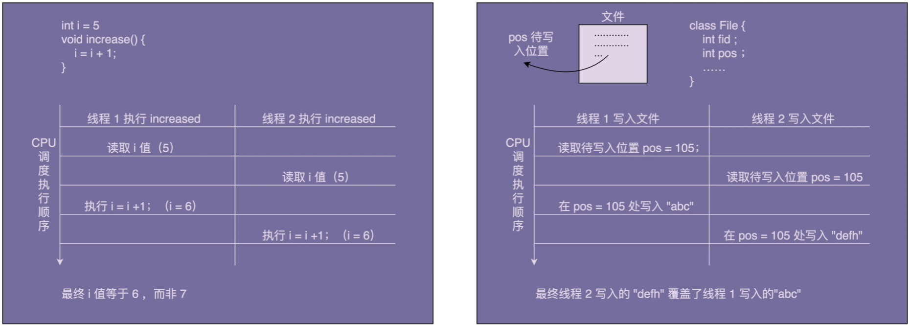
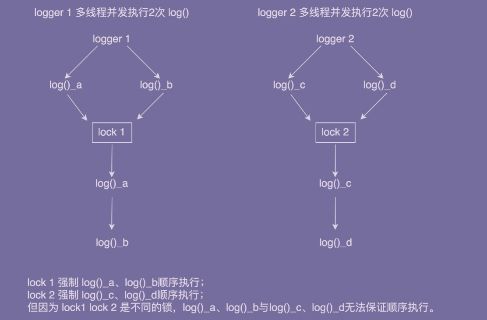

# 单例模式

经典的设计模式有 23 种，不过常用的可能都不到一半。先看一下单例模式，重点是搞清楚几个问题：

- 为什么要使用单例？
- 单例存在哪些问题？
- 单例与静态类的区别？
- 有何替代的解决方案？

## 为什么要使用单例

### 什么是单实例

> 单例设计模式（Singleton Design Pattern）理解起来非常简单。**一个类只允许创建一个对象**（或者实例），那这个类就是一个单例类，这种设计模式就叫作单例设计模式，简称单例模式。

### 用处

从概念上看，有些数据在系统中应该只保存一份，就比较合适设计为单例类，比如系统配置信息。除此之外，还可以用单例解决资源访问冲突的问题。

#### 表示全局唯一类

- 比如配置信息

在我们系统中，我们只有一个配置文件，当配置文件被加载到内存之后，以对象的形式存在，也应当只有一份。

- 比如唯一递增 ID 号码生成器

如果程序中有两个对象，那么就会存在重复 ID 的情况，所以我们应该将 ID 生成器设计为单例的。

```ts
// 模拟一下 AtomicLong
// AtomicLong是一个Java并发库中提供的一个原子变量类型,
// 它将一些线程不安全需要加锁的复合操作封装为了线程安全的原子操作， 
// 比如下面会用到的incrementAndGet()
class AtomicLong {
  id: number;

  constructor(initNumber: number) {
    this.id = initNumber;
  }

  incrementAndGet() {
    return this.id ++;
  }
}

class IdGenerator {
  private id = new AtomicLong(0);
  private static instance = new IdGenerator();

  constructor() {};

  public static getInstance() {
    return IdGenerator.instance;
  }

  public getId() {
    return this.id.incrementAndGet();
  }
}

const id1 = IdGenerator.getInstance().getId();
const id2 = IdGenerator.getInstance().getId();
const id3 = IdGenerator.getInstance().getId();
console.log(id1, id2, id3);
```

#### 处理资源访问冲突

> 主要在服务端多线程的情况下，这里了解一下相关知识点/背景

```java

public class Logger {
  private FileWriter writer;
  
  public Logger() {
    File file = new File("/Users/wangzheng/log.txt");
    writer = new FileWriter(file, true); //true表示追加写入
  }
  
  public void log(String message) {
    writer.write(message);
  }
}

// Logger类的应用示例：
public class UserController {
  private Logger logger = new Logger();
  
  public void login(String username, String password) {
    // ...省略业务逻辑代码...
    logger.log(username + " logined!");
  }
}

public class OrderController {
  private Logger logger = new Logger();
  
  public void create(OrderVo order) {
    // ...省略业务逻辑代码...
    logger.log("Created an order: " + order.toString());
  }
}
```

- **存在的问题**

会出现互相覆盖。分别创建两个 log 对象，在 Web 容器的 Servlet **多线程环境下**，如果两个 Servlet 线程同时分别执行 login() 和 create() 两个函数，并且同时写日志到 log.txt 文件中，可能会互相覆盖。



- **解决方法**

1. 加锁：给 log() 函数加互斥锁

```java

public class Logger {
  private FileWriter writer;

  public Logger() {
    File file = new File("/Users/wangzheng/log.txt");
    writer = new FileWriter(file, true); //true表示追加写入
  }
  
  public void log(String message) {
    synchronized(this) {
      writer.write(mesasge);
    }
  }
}
```

但是不能解决问题。这种琐是对象级别的，**一个对象在不同的线程下同时调用 log() 函数，会被强制要求顺序执行。但是，不同的对象之间并不共享同一把锁**。



1. 把对象级别的锁，换成类级别的锁

解决前面的问题，我们缓存类级别的锁就行，避免不同对象同时调用 log 函数。

```java

public class Logger {
  private FileWriter writer;

  public Logger() {
    File file = new File("/Users/wangzheng/log.txt");
    writer = new FileWriter(file, true); //true表示追加写入
  }
  
  public void log(String message) {
    synchronized(Logger.class) { // 类级别的锁
      writer.write(mesasge);
    }
  }
}
```

除了前面的方式，解决资源竞争的方法还有分布式锁、并发队列（多个线程往并发队列写日志，一个单独线程负责将并发队列中的数据写入日志文件）。

不过这些方式都比较复杂。

3. 使用单例

单例的思路比较简单，另外相比于锁有一些好处：不用创建那么多 Logger 对象，一方面**节省内存空间**，另一方面节省系统文件句柄（对于操作系统来说，文件句柄也是一种资源，不能随便浪费）

我们将 Logger 设计成一个单例类，程序中只允许创建一个 Logger 对象，所有的线程共享使用的这一个 Logger 对象，共享一个 FileWriter 对象，而 FileWriter 本身是对象级别线程安全的，就避免覆盖的问题。

```ts

public class Logger {
  private FileWriter writer;
  private static final Logger instance = new Logger();

  private Logger() {
    File file = new File("/Users/wangzheng/log.txt");
    writer = new FileWriter(file, true); //true表示追加写入
  }
  
  public static Logger getInstance() {
    return instance;
  }
  
  public void log(String message) {
    writer.write(mesasge);
  }
}

// Logger类的应用示例：
public class UserController {
  public void login(String username, String password) {
    // ...省略业务逻辑代码...
    Logger.getInstance().log(username + " logined!");
  }
}

public class OrderController {  
  public void create(OrderVo order) {
    // ...省略业务逻辑代码...
    Logger.getInstance().log("Created a order: " + order.toString());
  }
}
```

## 单实例的实现

概括起来，要实现一个单例，我们需要关注的点无外乎下面几个：

- 构造函数需要是 private 访问权限的，这样才能避免外部通过 new 创建实例；
- 考虑对象创建时的线程安全问题；
- 考虑是否支持延迟加载；
- 考虑 getInstance() 性能是否高（是否加锁）

### 饿汉式

在类加载的时候，instance 静态实例就已经创建并初始化好了，所以，instance 实例的创建过程**是线程安全**的。不过，这样的实现方式**不支持延迟加载**（在真正用到 IdGenerator 的时候，再创建实例）

从名字也可以看出来。具体实现如下：

```ts
class Singleton {
  // 构造函数需要是 private 访问权限的
  private constructor() {}

  // 类内部创建对象实例化
  private static instance: Singleton = new Singleton();

  // 提供一个公有的静态方法，返回实例对象
  public static getInstance(): Singleton {
    return this.instance;
  }

  public getId() {
    return 1;
  }
}

const id = Singleton.getInstance().getId()
```

有人觉得这种实现方式不好，因为不支持延迟加载，如果实例占用资源多（比如占用内存多）或初始化耗时长（比如需要加载各种配置文件），**提前初始化实例是一种浪费资源的行为**。最好的方法应该在用到的时候再去初始化。

不认同这样的观点：

- 初始化耗时长：那最好不要等到用到再初始化，这样会影响系统性能（例如响应客户请求的时候去初始化，就可能导致超时）。采用饿汉式实现方式，将耗时的初始化操作，提前到程序启动的时候完成，这样就能避免在程序运行的时候，再去初始化导致的性能问题。

- 实例占用资源多：按照 fail-fast 的设计原则（**有问题及早暴露**），那我们也希望在程序启动时就将这个实例初始化好。如果资源不够，就会在程序启动的时候触发报错，可以立即去修复。而不是系统中途去初始化占用资源过多，导致崩溃

### 懒汉式

对应的，就有懒汉式。懒汉式相对于饿汉式的优势是**支持延迟加载**。

```ts
class Singleton {
  // 先不实例化
  private static instance;
  private constructor () {};

  public static getInstance() {
    // 使用前再判断
    if (!instance) {
      Singleton.instance = new Singleton();
    }
    return Singleton.instance;
  }

  public getId() {
    return 1;
  }
}
```

不过懒汉式的缺点也很明显。**就是线程安全的问题**，如果被多个线程调用，会容易创建出多个实例，所以需要给 getInstance 加锁。

但是加锁之后会带来新的问题：**导致这个函数的并发度很低**。量化一下的话，并发度是 1，也就相当于串行操作了。而这个函数是在单例使用期间，一直会被调用。如果这个单例类偶尔会被用到，那这种实现方式还可以接受。但是，如果频繁地用到，那频繁加锁、释放锁及并发度低等问题，会导致性能瓶颈，这种实现方式就不可取了。

**js 是基于单线程运行代码，所以不存在线程不安全问题，推荐该种方法**

### 双重检测

饿汉式不支持延迟加载，懒汉式有性能问题，不支持高并发。再来看一种既支持延迟加载、又支持高并发的单例实现方式，也就是双重检测实现方式。

和懒汉式的区别就是，**把方法锁改成类锁**。这样只要 instance 创建之后，再调用 getInstance 也不会有加锁的逻辑。

```java
public class IdGenerator { 
  private AtomicLong id = new AtomicLong(0);
  private static IdGenerator instance;
  private IdGenerator() {}
  // public static synchronized IdGenerator getInstance()
  // =>
  public static IdGenerator getInstance() {
    if (instance == null) {
      synchronized(IdGenerator.class) { // 此处为类级别的锁
        if (instance == null) {
          instance = new IdGenerator();
        }
      }
    }
    return instance;
  }
  public long getId() { 
    return id.incrementAndGet();
  }
}
```

## 单例模式存在的问题

尽管单例模式是一个很常用的模式，但是有些人认为单例是一种反模式（anti-pattern），并不推荐使用。

那么单例这种设计模式存在哪些问题？为什么会被称为反模式？如果不用单例，该如何表示全局唯一类？有何替代的解决方案？

### 单例对 OOP 特性的支持不友好

```ts
class Order {
  create() {
    const id = IdGenerator.getInstance().getId();
  }
}

class User {
  create() {
    const id = IdGenerator.getInstance().getId();
  }
}
```

IdGenerator 的使用方式**违背了基于接口而非实现的设计原则**，也就违背了广义上理解的 OOP 的抽象特性。

如果某一天，我们希望针对不同的业务采用不同的生成算法，**那么就需要修改所有用到 IdGenerator 类的地方，代码改动就会比较大**。

```ts
class Order {
  create() {
    const id = IdGenerator.getInstance().getId();
    // 替换成 =>
    const id = OrderIdGenerator.getInstance().getId();
  }
}

class User {
  create() {
    const id = IdGenerator.getInstance().getId();
    // 替换成 =>
    const id = UserIdGenerator.getInstance().getId();
  }
}
```

除此之外，单例对继承、多态特性的支持也不友好。所以一旦选择设计为单例类，就意味着放弃继承和多态这两个强有力的面向对象的特性。

### 单例会隐藏类之间的依赖关系

在阅读代码的时候，我们希望**一眼就能看出**类与类之间的依赖关系，搞清楚这个类依赖了哪些外部类。

通过**构造函数**、**参数传递**等方式声明类之间的依赖关系，我们直接可以通过函数的定义就可很容易识别出来。但是单例类不需要显示创建、不依赖参数传递，直接调用就可以，这种调用关系会比较隐蔽。阅读代码的时候仔细查看每个函数的实现才知道到底这个类依赖了哪些类。

### 单例对代码的扩展性不友好

单例类只有一个对象实例，如果有一天我们需要两个或者多个实例类，那怎么办呢？

比如数据库连接池，初期我们认为系统中应该只有一个连接池，这样方便我们控制对数据库连接资源的消耗，所以设计成单例类。

但是之后发现，有些 SQL 会很慢，它们长时间占用数据库连接资源会导致其他 SQL 无法响应。希望将慢 SQL 和其他 SQL 分开。为了实现这个目标就需要创建两个数据库连接池了。

这个时候最初的单例类就无法满足这样的需求，也就是说单例类在某些情况下会影响扩展性、灵活性。

### 单例对代码的可测试性不友好

- 无法 mock：如果单例类依赖比较重的外部资源，比如 DB，那么写单测的时候一般会通过 mock 来将它替换，但是单实例这种硬编码的方式导致无法 mock。
- 成员变量类似全局变量：单例类持有成员变量（例如 IdGenerator 的 id），相当于全局变量，被所有代码共享，我们写单测的时候还需要考虑不同用例之间的影响。

### 单例不支持有参数的构造函数

单例不支持有参数的构造函数，比如我们创建一个连接池的单例对象，我们没法通过参数来指定连接池的大小。

解决的方法：

- 第一种方法：创建实例之后，在使用前，通过调用 init() 函数传递参数。

```ts
class Singleton {
  // 先不实例化
  private static instance;
  private paramA;
  private paramB
  private constructor (paramA, paramB) {
    this.paramA = paramA;
    this.paramB = paramB;
  };

  public static getInstance() {
    // 使用前再判断
    if (!instance) {
      throw new Error('Run init first.')
    }
    return Singleton.instance;
  }

  public static init(paramA, paramB) {
    if (Singleton.instance != null) {
      throw new Error('Singleton has been created!')
    }

    Singleton.instance = new Singleton(paramA, paramB);
    return Singleton.instance;
  }

  public getId() {
    return 1;
  }
}
```

- 第二种方法：将参数放到 getInstance() 方法中

```ts
class Singleton {
  // 先不实例化
  private static instance;
  private paramA;
  private paramB
  private constructor (paramA, paramB) {
    this.paramA = paramA;
    this.paramB = paramB;
  };

  public static getInstance(paramA, paramB) {
    // 使用前再判断
    if (!instance) {
      Singleton.instance = new Singleton(paramA, paramB)
    }
    return Singleton.instance;
  }

  public getId() {
    return 1;
  }
}
```

但是这种方法，当我们执行两次的时候第二次是不生效的，另外在构建过程中也没有给予提示，容易误导用户。

```ts
const instance1 = Singleton.getInstance(1, 2);
const instance2 = Singleton.getInstance(3, 4); // 配置实际没有生效
```

要解决这个问题可以提供一个 update 方法

```ts
class Singleton {
  //...
  public updateConfig(paramA, paramB) {
    Singleton.instance.paramA = paramA;
    Singleton.instance.paramB = paramB;
  }
}
```

- 第三种方法：讲参数放到另外一个全局变量。

下面通过静态常量来定义。也可以从配置文件中加载得到。

```ts
class Config {
  public static paramA = 1;
  public static paramB = 2;
}

class Singleton {
  // 先不实例化
  private static instance;
  private paramA;
  private paramB
  private constructor () {
    this.paramA = Config.paramA;
    this.paramB = Config.paramB;
  };

  public static getInstance() {
    // 使用前再判断
    if (!instance) {
      Singleton.instance = new Singleton()
    }
    return Singleton.instance;
  }
}
```

## 有何替代解决方案

即便单例有这么多问题，但是不用不行啊，业务上有表示全局唯一类的需求。如果不用单例，怎么解决这个问题呢？

### 使用静态方法可以吗

为了保证全局唯一，除了使用单例，还可以使用 静态方法来实现。这也是项目开发中经常用到的一种实现思路。

```ts
class IdGenerator {
  private static id = new AtomicLong(0);

  public static getId() {
    return id.incrementAndGet();
  }
}

// 使用
const id = IdGenerator.getId();
```

不过静态方法并不能解决之前提到的问题。实际上，**它比单例更加不灵活**，比如，它无法支持延迟加载。

### 通过依赖注入呢

单例除了前面的使用方式之外，还有另外一种方法，具体的代码如下：

```ts
// 老的使用方式
function demoFunction() {
  const id = IdGenerator.getInstance.getId();
}

// 新的使用方式：依赖注入
function demoFunction(idGenerator) {
  const id = idGenerator.getId;
}

// 调用时将 idGenerator 传入
const idGenerator = IdGenerator.getInstance();
demoFunction(idGenerator);
```

通过依赖注入的方式，可以寄解决单例隐藏类之间依赖关系的问题。不过，对单例存在的其他问题，比如 OOP 特性、扩展性、可测试性不友好的问题，还是无法解决。

**如果要完全解决这些问题，我们可能要从根本上，寻找其他方式来实现全局唯一的类**。实际上，类对象的全局唯一性可以通过多种不同的方式来保证：

- 我们既可以通过单例模式来强制保证
- 也可以通过工厂模式、IOC 容器（比如 Spring IOC 容器）来保证
- 还可以通过程序员自己来保证（自己在编写代码的时候自己保证不要创建两个类对象）
