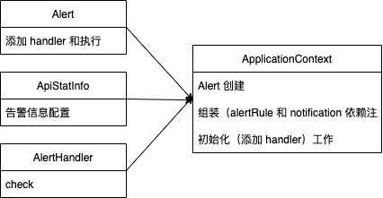
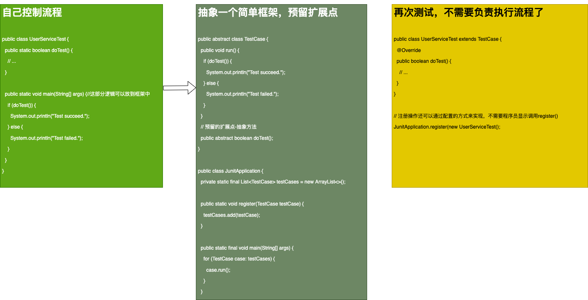

# SOLID

**设计原则是指导我们代码设计的一些经验总结**。对是否应用某种设计模式具有指导意义。设计原则有个非常大的特点，那就是这些特点听起来都比较抽象，定义描述都比较模糊，不同的人会有不同解读。

接下来，学习一些经典设计原则，其中包括 SOLID、KISS、YAGNI、DRY、LOD 等，介绍这些原则的定义，**原则设计的初衷，能解决哪些问题，有哪些应用场景等**。

SOLID 原则并非单纯的 1 个原则，而是由 5 个设计原则组成的，它们分别是：

- S：单一职责原则
- O：开闭原则
- L：里式替换原则
- I：接口隔离原则
- D：依赖反转原则

## 单一职责原则 Single Responsibility Principle

### 如何理解单一指责原则

单一职责原则的英文是 Single Responsibility Principle，缩写为 SRP。这个原则的英文描述是这样的：A class or module should have a single responsibility。如果我们把它翻译成中文，那就是：**一个类或者模块只负责完成一个职责（或者功能）**

这个原则的描述对象包含两个：**类（class）和模块（module）**

关于这个概念有两个理解方式：

- 把模块看作是**更加抽象的概念**，类也可以看作模块；
- 把模块看作比类**更粗粒度的代码块**，模块包含多个类，多个类组成一个模块。

接下来只从“类”的角度进行分析。

单一指责定义很简单，也很好理解。**一个类只负责完成一个职责或功能，也就是说不要设计大而全的类，要设计粒度小、功能单一的类**。如果把两个或两个以上业务不相干的功能放到一个类中，那么我们就可以说它的职责不单一，应该进行拆分。

例如一个类包含了订单的一些操作，也包含了用户的一些操作，而订单和用户是两个独立的业务模型，将两个不相干的功能放到一个类中，就违反单一指责原则。

### 怎么判断职责是否单一

虽然有时我们容易看出两个功能是否想干，但是在大部分真实开发中，**对于一个类是否职责单一的判断是很拿捏的**。

举个列子，在一个社交商品中，用下面 UserInfo 类来记录用户信息：

``` ts
class UserInfo {
  private userId: number;
  private username: string;
  private email: string;
  private telephone: string;
  private createTime: number;;
  private lastLoginTime: number;;
  private avatarUrl: string;
  private provinceOfAddress: string; // 省
  private cityOfAddress: string; // 市
  private regionOfAddress: string; // 区 
  private detailedAddress: string; // 详细地址
  // ...省略其他属性和方法...
}
```

你觉得它是否满足单一职责原则呢？

关于这个问题有两个观点：

1.UserInfo 都是跟用户相关的信息，所有属性和方法都隶属于用户这个业务模型，满足单一指责；<br/>
2.地址信息在 UserInfo 中占比比较重，可以拆分成独立的 UserAddressInfo 类，拆分之后两个类职责更加单一。

**做选择的时候不能脱离具体的应用场景**。如果地址信息和其他信息，只是单纯用来展示，那现在 UserInfo 的设计是合理的；如果产品发展很好，之后又添加了电商模块，用户地址信息还会用在电商物流中，那最好是将地址信息从 UserInfo 中拆分出来独立成用户物流信息（或者叫地址信息）

从刚刚这里例子可以总结出：

- 不同应用场景、不同阶段的需求背景下，对同一个类的职责是否单一的判断，可能都是不一样。
- 另外从不同业务层面，去看待同一个类的设计，对类是否职责单一，也会有不同的认识。如果从“用户”这个业务层面，UserInfo 包含所有用户满足单一职责原则；从“用户展示信息”、“地址信息”等这些更细粒度的业务层面来看，那 UserInfo 就应该继续拆分。

这样看来，**判断一个类的职责是否单一没有一个明确的、可以量化的标准**。这是一件非常主观的事情。

**在真正的软件开发中，我们没必要过于未雨绸缪，过度设计**。可以先写一个粗粒度的类，满足业务需求。随着业务发展，如果粗粒度的类越来越大，代码越来越多，这个时候我们就可以将这个类，拆分成几个更细粒度的类。这就是所谓的**持续重构**。

#### 判断技巧

为了更好拿捏这个原则，这里有些小技巧，能够很好帮你从侧面上判定一个类是否足够单一。比起主观的思考更有指导意义、更有可执行性。

- 类太大：类中的代码行数、函数或属性过多，会影响代码的可读性和可维护性，我们就需要考虑对类进行拆分；
- 类依赖太多（**耦合重**）：类依赖的其他类过多，或者依赖类的其他类过多，不符合高内聚、低耦合的设计思想，我们就需要考虑对类进行拆分；
- 私有方法过多不能复用：私有方法过多，我们就要考虑能否将私有方法独立到新的类中，设置为 public 方法，供更多的类使用，从而提高代码的复用性；
- 很难命名：比较难给类起一个合适名字，很难用一个业务名词概括，或者只能用一些笼统的 Manager、Context 之类的词语来命名，这就说明类的职责定义得可能不够清晰；
- 方法只和少数属性相关：类中大量的方法都是集中操作类中的某几个属性，比如，在 UserInfo 例子中，如果一半的方法都是在操作 address 信息，那就可以考虑将这几个属性和对应的方法拆分出来。

不过，上面的判断原则还是“模糊的”，代码函数多少才算多？前期我们约定可以量化的标准，例如代码函数不超过 200 行。随着经验的积累，就可以在开发中慢慢“品尝”出来。就像大厨“放少许盐”。

### 类的职责是否设计越单一越好

答案是否定的。

还是看一个例子，Serialization 类实现了一个简单协议的序列化和反序列功能。

```ts

/**
 * Protocol format: identifier-string;{gson string}
 * For example: UEUEUE;{"a":"A","b":"B"}
 */
class Serialization {
  private static IDENTIFIER_STRING: string = "UEUEUE;";
  private gson;
  
  constructor() {
    this.gson = new Gson();
  }
  
  serialize() {
    const textBuilder = new StringBuilder();
    textBuilder.append(IDENTIFIER_STRING);
    textBuilder.append(gson.toJson(object));
    return textBuilder.toString();
  }
  
  deserialize(text: string) {
    if (!text.startsWith(IDENTIFIER_STRING)) {
        return Collections.emptyMap();
    }
    const gsonStr = text.substring(IDENTIFIER_STRING.length());
    return gson.fromJson(gsonStr, Map.class);
  }
}
```

如果想当职责更加单一，拆分成两个类：一个负责序列化，一个负责反序列化。

```ts
class Serialize {
  private static IDENTIFIER_STRING: string = "UEUEUE;";
  private gson;
  
  constructor() {
    this.gson = new Gson();
  }
  
  serialize() {
    // ...
  }
}

class Deserializer {
  private static IDENTIFIER_STRING: string = "UEUEUE;";
  private gson;
  
  constructor() {
    this.gson = new Gson();
  }
  
  deserialize(text: string) {
    // ...
  }
}
```

拆分之后职责更单一，但是带来了一些新问题，可维护性更差了：

- 不内聚：如果我们需要修改协议格式（JSON => XML），那么两个类都需要修改
- 容易修改漏：如果修改的时候只改了 Serialize，忘记修改 Deserializer 就导致序列化、反序列化不匹配出错

<nx-tip type="warning" text="实际上，不管是应用设计原则还是设计模式，最终的目的还是**提高代码的可读性、可扩展性、复用性、可维护性等**。我们在考虑应用某一个设计原则是否合理的时候，也可以以此作为最终的考量标准。"/>

**单一职责：将相关的“在一起”，提高内聚，避免不相关的“在一起”，降低耦合，讲的是可维护性问题**。

## 开闭原则 Open Closed Principle

开闭原则是 SOLID 中最难理解、最难掌握，同时也是最有用的一条原则。

- 难理解：怎么定义代码的“扩展”、“修改”，怎样算满足或违反“开闭原则”
- 难掌握：如果做到“对扩展开放、修改关闭”，如何在项目中灵活应用“开闭原则”，以避免影响代码可读性
- 最有用：**扩展性**是代码质量最重要的衡量标准之一。大部分设计模式就是为了解决代码的扩展性而存在的，主要遵从的设计原则就是开闭原则

### 如何理解“对扩展开发、修改关闭”

开闭原则的英文全称是 Open Closed Principle，简写为 OCP。它的英文描述是：software entities (modules, classes, functions, etc.) should be open for extension , but closed for modification。我们把它翻译成中文就是：**软件实体（模块、类、方法等）应该“对扩展开放、对修改关闭”**。

更详细的表述就是：**添加一个新的功能应该是，在已有代码基础上扩展代码（新增模块、类、方法等），而非修改已有代码（修改模块、类、方法等）**。

看一个例子，API 接口监控告警代码

```ts
/**
 * 其中：
 * AlertRule 存储告警规则，可以自由设置。
 * Notification 是告警通知类，支持邮件、短信、微信、手机等多种通知渠道。
 * NotificationEmergencyLevel 表示通知的紧急程度，包括 SEVERE（严重）、URGENCY（紧急）、NORMAL（普通)
 * 
 */
class Alert {
  private rule: AlertRule;
  private notification: Notification;

  constructor(rule: AlertRule, notification: Notification) {
    this.rule = rule;
    this.notification = notification;
  }

  public void check(api: string, requestCount: number, errorCount: number,  durationOfSeconds: number) {
    const tps = requestCount / durationOfSeconds;
    if (tps > rule.getMatchedRule(api).getMaxTps()) {
      notification.notify(NotificationEmergencyLevel.URGENCY, "...");
    }
    if (errorCount > rule.getMatchedRule(api).getMaxErrorCount()) {
      notification.notify(NotificationEmergencyLevel.SEVERE, "...");
    }
  }
}
```

代码比较简单，逻辑集中在 check 方法中。现在我们需要**增加一个功能**，当每秒接口请求超时个数大于设定值时，触发告警。

#### 在现有代码上改动

- 增加 check 入参：增加新的统计数据 timeoutCount，表示超时请求数
- 增加告警规则：在 check 中添加新的告警逻辑

```ts
class Alert {
  //...
  public void check(api: string, requestCount: number, errorCount: number, timeoutCount: number  durationOfSeconds: number) {
    // ...
    const timeoutTps = timeoutCount / durationOfSeconds; 
    if (timeoutTps > rule.getMatchedRule(api).getMaxTimeoutTps()) { 
      notification.notify(NotificationEmergencyLevel.URGENCY, "..."); 
    }
  }
}
```

#### 存在的问题

- 对接口进行了修改，意味着所有调用这个接口的代码都要做相应的修改
- 另一方面，修改了 check，相应单元测试都需要修改

属于基于“修改”的方式实现功能**修改了代码的实现**。

#### 更好的方式，遵循开闭原则

通过“扩展方式”来实现。为了让它的扩展性更好，重构之前的代码。

- 将多个入参封装成 ApiStatInfo 类
- 引入 handler，将 if 判断逻辑分散在各个 handler 中

```ts

class Alert {
  private alertHandlers: Array<AlertHandler> = [];
  
  addAlertHandler(alertHandler: AlertHandler) {
    this.alertHandlers.add(alertHandler);
  }

  check(apiStatInfo: ApiStatInfo) {
    alertHandlers.forEach(handler => handler.check(apiStatInfo));
  }
}

class ApiStatInfo {//省略constructor/getter/setter方法
  private api: string;
  private requestCount: number;
  private errorCount: number;
  private durationOfSeconds: number;
}

// 定义抽象类
abstract class AlertHandler {
  protected rule: AlertRule;
  protected notification: Notification;

  constructor(rule: AlertRule, notification: Notification) {
    this.rule = rule;
    this.notification = notification;
  }
  abstract check(apiStatInfo: ApiStatInfo);
}

// 继承，代码复用
class TpsAlertHandler extends AlertHandler {
  constructor(rule: AlertRule, notification: Notification) {
    super(rule, notification);
  }

  check(apiStatInfo: ApiStatInfo) {
    const tps = apiStatInfo.getRequestCount()/ apiStatInfo.getDurationOfSeconds();
    if (tps > rule.getMatchedRule(apiStatInfo.getApi()).getMaxTps()) {
      notification.notify(NotificationEmergencyLevel.URGENCY, "...");
    }
  }
}

class ErrorAlertHandler extends AlertHandler {
  // ...
}

```

接下来看看怎么新增上面的功能？

首先创建一个类，负责 Alert 的创建、组装（alertRule 和 notification 依赖注入）、初始化（添加 handler）工作。

```ts
class ApplicationContext {
  private alertRule: AlertRule; 
  private notification: Notification; 
  private alert: Alert;
  private static instance: ApplicationContext;

  constructor() {
    this.initializeBeans();
  }

  initializeBeans() {
    this.alertRule = new AlertRule(/*.省略参数.*/); //省略一些初始化代码
    this.notification = new Notification(/*.省略参数.*/); //省略一些初始化代码
    this.alert = new Alert();
    this.alert.addAlertHandler(new TpsAlertHandler(alertRule, notification));
    this.alert.addAlertHandler(new ErrorAlertHandler(alertRule, notification));
  }

  getAlert() {
    return this.alert;
  }

  // 单实例
  public static getInstance() { 
    if (this.instance) {
      return this.instance;
    } else {
      this.instance = new ApplicationContext();
      return this.instance;
    }
  }
}

class Demo {
  constructor() {
    const apiStatInfo: ApiStatInfo = new ApiStatInfo();
    // ...省略设置apiStatInfo数据值的代码
    ApplicationContext.getInstance().getAlert().check(apiStatInfo);
  }
}
```

这个是再修改那个代码：

- 第一处改动是：在 ApiStatInfo 类中添加新的属性 timeoutCount。
- 第二处改动是：添加新的 TimeoutAlertHander 类。
- 第三处改动是：在 ApplicationContext 类的 initializeBeans() 方法中，往 alert 对象中注册新的 timeoutAlertHandler。
- 第四处改动是：在使用 Alert 类的时候，需要给 check() 函数的入参 apiStatInfo 对象设置 timeoutCount 的值。

```ts
class ApiStatInfo {
  //...
  // 改动一：添加新字段
  private timeoutCount: number; 
}

// 改动二：添加新的handler
class TimeoutAlertHandler extends AlertHandler { 
  // ...
} 

class ApplicationContext {
  // ...
  constructor() {
    this.initializeBeans();
  }
  initializeBeans() {
    // ...
    // 改动三：注册handler
    this.alert.addAlertHandler(new TimeoutAlertHandler(alertRule, notification));
  }

}

class Demo {
  constructor() {
    const apiStatInfo: ApiStatInfo = new ApiStatInfo();
    // 改动四：设置tiemoutCount值
    apiStatInfo.setTimeoutCount(289);
    ApplicationContext.getInstance().getAlert().check(apiStatInfo);
  }
}
```



重构之后代码更加易扩展，如果想加新的功能：

- 只需要基于扩展方式创建新的 handler 类即可，不需要改原来的 check() 函数逻辑。
- 而且只需求为新添加的 handler 类增加单元测试，老的单元测试不会失败。

### 修改代码就意味着违背开闭原则吗

对于重构之后的代码，除了改动二是基于扩展而非修改的方式完成的，但是其他貌似不是基于扩展而是基于修改来完成的，那是不是违背了开闭原则吗？

#### 改动一 添加新的属性 timeoutCount

实际上不仅往类添加属性，还添加了对应的 getter/setter 方法，所以这个问题是：**给类中添加新的属性和方法，算作“修改”还是“扩展”？**

回忆一下开闭原则的定义：软件实体（**模块、类、方法等**）应该“对扩展开放、对修改关闭”。从定义中可以看出，开闭原则可以用在不同粒度的代码中，可以是模块、类、方法（及属性）

**同样一个代码改动，在粗代码粒度下，被认定为“修改”，在细代码粒度下，又可以被认定为“扩展”**。

改动一，在类层面，添加属性和方法，可以被认定为“修改”；但在方法（及属性）层面上，没有修改已有属性和方法，又可以认定为“扩展”。

回到这条原则的初衷，我们不用纠结它是否违背“开闭原则”。**只要它没有破坏原有的代码的正常运行，没有破坏原有的单元测试，我们就可以说，这是一个合格的代码改动**。

#### 改动三和四 增加注册和入参的设置

这两处修改是在方法内部进行的，不管从哪个层面上来看都不能算是“扩展”。不过**有些修改是难免的**，是可以接受的。

我们要认识到，添加一个功能，不可能任何模块、类、方法的代码都不“修改”，这个是做不到的。类需要创建、组装、并做一些初始化操作，才能构建成可运行的程序。我们要做的是**尽量让修改操作更集中、更少、更上层，尽量让最核心、最复杂的那部分代码满足开闭原则**。
### 如何做到“对扩展开放、修改关闭”

在前面的例子中，实现需要一些经验。不过要做到“对扩展开放、修改关闭”，也有一些指导思想和方法论。

**实际上，开闭原则讲的就是代码的扩展性问题，是判断一段代码是否易扩展的“金标准”**。

#### 具备潜意识

介绍方法论之前，我们先一些更偏向顶层的指导思想。**为了写出扩展性好的代码，要时刻具备扩展意识、抽象意识、封装意识，这些“潜意识”比任何开发技巧都重要**。

- 写代码的时候，多花心思思考一下，预留扩展点，未来需求变化的时候不需要做代码改动、改动很小，做到“对扩展开发、对修改关闭”
- 识别代码可变部分和不可变部分之后，将可变部分封装起来，隔离变化，提供抽象化的不可变接口给上层使用（基于接口而非实现编程）。这样当实现发现变化的时候，只需要基于相同的抽象接口，扩展一个新的实现，替换掉老实现就可以了。

#### 方法论

**在众多的设计原则、思想、模式中，最常用来提高代码扩展性的方法有：多态、依赖注入、基于接口而非实现编程，以及大部分的设计模式（比如，装饰、策略、模板、职责链、状态等）**。

多态、依赖注入、基于接口而非实现编程，以及前面提到的抽象意识，说的都是同一种思路，只是从不同角度、不同层面阐述而已。这也体现了“很多设计原则、思想、模式都是想通的”这一思想。

下面看一个例子：

- 要学会将其**抽象**成一组跟具体消息队列（Kafka）无关的异步消息接口
- 上层系统都依赖这组抽象的**接口编程**，并且通过**依赖注入**的方式来调用

```ts
// 这一部分体现了抽象意识
interface MessageQueue { /** */ }
class KafkaMessageQueue implements MessageQueue { /** */ }
class RocketMQMessageQueue implements MessageQueue {/** */}

interface MessageFromatter { /** */ }
class JsonMessageFromatter implements MessageFromatter {/** */}
class ProtoBufMessageFromatter implements MessageFromatter {/** */}

class Demo {
  private msgQueue: MessageQueue; // 基于接口而非实现编程
  constructor(msgQueue: MessageQueue) { // 依赖注入
    this.msgQueue = msgQueue;
  }
  
  // msgFormatter：多态、依赖注入
  sendNotification(notification: Notification, msgFormatter: MessageFormatter) {
    //...    
  }
}
```

### 如何在项目中灵活应用开闭原则

写出支持“对扩展开放、对修改关闭”的代码的**关键是预留扩展点**。那问题是如何才能识别出所有可能的扩展点呢？

- 业务导向系统：要识别扩展点，就要对业务有足够的了解，能够知道当下以及未来可能要支持的业务需求。
- 业务无关、偏底层系统：你需要了解“它们会被如何使用？今后你打算添加哪些功能？使用者未来会有哪些更多的功能需求？”

不过，“唯一不变的只有变化本身”。即便我们很了解也不能识别出所有扩展点。即便都识别出来，对所有扩展点都预留位置，成本也是不可接受的。

**没必要为一些遥远的、不一定发生的需求去提前买单，做过度设计**。

**对于一些比较确定的、短期内可能就会扩展，或者需求改动对代码结构影响比较大的情况，或者实现成本不高的扩展点，在编写代码的时候之后，我们就可以事先做些扩展性设计。而不确定的、实现复杂的，可以等到有需求驱动的时候在通过重构来支持。**

而且，开闭原则也不是免费的，有些时候和可读性会有冲突，需要做些权衡。之前的例子中，如果告警规则不多，也不复杂，那么最开始的方式 check 中用 if 判断，整体逻辑不复杂，代码行数也不对，思路更加简单易读，就是比较合理的选择。反之，第二种方式更合适。

## 里式替换 Liskov Substitution Principle

整体上这个原则比较简单，主要通过几个反例，看看，哪些代码是违反里式替换原则的？我们该如何将它们改造成满足里式替换原则？

另外这条原则的定义和“多态”有点类似，也介绍它跟多态的区别。

### 如何理解“里式替换原则”

里式替换原则的英文翻译是：Liskov Substitution Principle，缩写为 LSP。这个原则最早是在 1986 年由 Barbara Liskov 提出，他是这么描述这条原则的：

> If S is a subtype of T, then objects of type T may be replaced with objects of type S, without breaking the program。

在 1996 年，Robert Martin 在他的 SOLID 原则中，重新描述了这个原则，英文原话是这样的：

> Functions that use pointers of references to base classes must be able to use objects of derived classes without knowing it。

综合起来，用中文描述是：**子类对象**（object of subtype/derived class）能够替换程序（program）中**父类对象**（object of base/parent class）出现的任何地方，并且**保证原来程序的逻辑行为（behavior）不变及正确性不被破坏**。

看个例子：

```ts

class Transporter {
  private httpClient: HttpClient;
  public Transporter(httpClient: HttpClient) {
    this.httpClient = httpClient;
  }
  public Response sendRequest(Request request) {
    // ...use httpClient to send request
  }
}

public class SecurityTransporter extends Transporter {
  private String appId;
  private String appToken;

  constructor(httpClient: HttpClient, appId: String,  appToken: String) {
    super(httpClient);
    this.appId = appId;
    this.appToken = appToken;
  }

  sendRequest(request: Request): Response {
    if (StringUtils.isNotBlank(appId) && StringUtils.isNotBlank(appToken)) {
      request.addPayload("app-id", appId);
      request.addPayload("app-token", appToken);
    }
    return super.sendRequest(request);
  }
}

class Demo {    
  public demoFunction(transporter: Transporter) {    
    const request: Reuqest = new Request();
    //...省略设置request中数据值的代码...
    const response: Response = transporter.sendRequest(request);
    //...省略其他逻辑...
  }
}

// 里式替换原则
const demo = new Demo();
demo.demofunction(new SecurityTransporter(/*省略参数*/););
```

子类 SecurityTransporter 的设计完全符合里式替换原则，可以替换父类出现的任何位置，并且原来代码的逻辑行为不变且正确性也没有被破坏。

- 这个代码设计不就是简单利用了面向对象的多态特性吗？

从刚刚的例子和定义描述来看，**里式替换原则跟多态看起来确实有点类似，但实际上它们完全是两回事**。

- 为什么这么说呢？

把上面例子改一下

```ts
{
  sendRequest(request: Request): Response {
    if (StringUtils.isNotBlank(appId) && StringUtils.isNotBlank(appToken)) {
      // 抛出异常
      throw new Error('xxx')
    }
    request.addPayload("app-id", appId);
    request.addPayload("app-token", appToken);
    return super.sendRequest(request);
  }
}
```

改造后，传入 demofunction 的是父类，那么不会抛出异常，但如果是子类，那么有可能抛出异常。子类替换父类传递进 demoFunction 函数之后，整个程序的逻辑行为**有了改变**。

改造之后仍然可以通过 Java 的多态语法，动态使用子类 SecurityTransporter 来替换父类 Transporter，并不会导致程序编译/运行报错。但是，从设计思路里式替换原则。

#### 里式替换和多态的区别

**所以说多态和里式替换有点类似，但是关注点不同**：
- 多态：是面向对象的特性，也是面向对象编程语言的一种语法，是一种代码实现的思路。
- 里式替换：是一种设计原则，用来指导继承关系中的子类如何设计。子类要保证替换父类的时候，不改变原有的逻辑，不破坏原有程序的正确性。

### 哪些代码明显违背了 LSP

里式替换原则还有另外一个更加能落地、更有指导意义的描述，那就是“Design By Contract”，中文翻译就是“**按照协议来设计**”。

具体来说，子类在设计的时候，要遵守父类的行为约定（或者叫协议）。父类定义了函数的行为约定，那子类可以改变函数的内部实现逻辑，但不能改变函数原有的行为约定。

这里的行为约定包括：

- 函数声明要实现的功能；
- 对输入、输出、异常的约定；
- 甚至包括注释中所罗列的任何特殊说明。

实际上，定义中父类和子类之间的关系，也可以替换成接口和实现类之间的关系。

#### 子类违背父类声明要实现的功能

父类中提供的 sortOrdersByAmount() 订单排序函数，是**按照金额从小到大**来给订单排序的，而子类重写这个 sortOrdersByAmount() 订单排序函数之后，是**按照创建日期**来给订单排序的。那子类的设计就违背里式替换原则。

#### 子类违背父类对输入、输出、异常的约定

在父类中，某个函数约定：运行出错的时候返回 null；获取数据为空的时候返回空集合（empty collection）。而子类重载函数之后，实现变了，运行出错返回异常（exception），获取不到数据返回 null。那子类的设计就违背里式替换原则。

#### 子类违背父类注释中所罗列的任何特殊说明

父类中定义的 withdraw() 提现函数的注释是这么写的：“用户的提现金额不得超过账户余额……”，而子类重写 withdraw() 函数之后，针对 VIP 账号实现了透支提现的功能，也就是提现金额可以大于账户余额，那这个子类的设计也是不符合里式替换原则的。

以上便是三种典型的违背里式替换原则的情况。除此之外，**判断子类的设计实现是否违背里式替换原则，还有一个小窍门，那就是拿父类的单元测试去验证子类的代码**。如果某些单元测试运行失败，就有可能说明，子类的设计实现没有完全地遵守父类的约定，子类有可能违背了里式替换原则。

里式替换这个原则是非常宽松的，一般写代码不怎么回违背它。

## 接口隔离原则 Interface Segregation Principle

这个原则，最关键就是理解其中“接口”的含义。除此之外，接口隔离原则跟我们之前讲到的**单一职责原则**还有点儿类似，所以也会具体讲一下它们之间的区别和联系。

### 如何理解“接口隔离原则”

接口隔离原则的英文翻译是“ Interface Segregation Principle”，缩写为 ISP。Robert Martin 在 SOLID 原则中是这样定义它的：“Clients should not be forced to depend upon interfaces that they do not use。”

直译成中文的话就是：**客户端不应该被强迫依赖它不需要的接口**。其中的“客户端”，可以理解为接口的调用者或者使用者。

“接口”在不同场景有不同理解，在生活中可以是插座接口，在软件开发中，可以是一组抽象的约定、系统之间的 API 接口、还可以特指面向对象编程语言的接口。理解接口隔离原则的关键，就是理解其中的“接口”二字。在这条原则中，我们可以把“接口”理解为下面三种东西：

- 一组 API 接口集合
- 单个 API 接口或函数
- OOP 中的接口概念

### 把“接口”理解为一组 API 接口集合

看个例子，微服务用户系统提供了一组跟用户相关的 API 给其他系统使用，比如：注册、登录、获取用户信息等

```ts

interface UserService {
  register(String cellphone, String password): boolean;
  login(String cellphone, String password): boolean;
  getUserInfoById(long id): UserInfo;
  getUserInfoByCellphone(String cellphone): UserInfo;
}

class UserServiceImpl implements UserService {
  //...
}
```

现在，我们的后台管理系统要实现删除用户的功能，希望用户系统提供一个删除用户的接口。这个时候我们该如何来做呢？

你可能会说，这不是很简单吗，我只需要在 UserService 中新添加一个 deleteUserByCellphone() 或 deleteUserById() 接口就可以了

可以解决问题，但是也隐藏了一些安全隐患：删除用户是一个非常慎重的操作，我们只希望通过后台管理系统来执行，所以这个接口只限于给后台管理系统使用。如果我们把它放到 UserService 中，**那所有使用到 UserService 的系统，都可以调用这个接口**。不加限制地被其他业务系统调用，就有可能导致误删用户。

当然，最好的解决方案是从架构设计的层面，通过接口鉴权的方式来限制接口的调用。不过，如果暂时没有鉴权框架来支持，我们**还可以从代码设计的层面，尽量避免接口被误用**。

**参照接口隔离原则，调用者不应该强迫依赖它不需要的接口，将删除接口单独放到另外一个接口** RestrictedUserService 中，然后将 RestrictedUserService 只打包提供给后台管理系统来使用。

```ts
interface UserService {
  register(String cellphone, String password): boolean;
  login(String cellphone, String password): boolean;
  getUserInfoById(long id): UserInfo;
  getUserInfoByCellphone(String cellphone): UserInfo;
}

// 拆分
interface RestrictedUserService {
  deleteUserByCellphone(String cellphone): boolean;
  deleteUserById(long id): boolean;
}

// 只给管理系统使用
class UserServiceImpl implements UserService, RestrictedUserService {
  //...
}
```

这个例子中，把接口隔离原则中的接口，理解为一组接口集合，它可以是某个微服务的接口，也可以是某个类库的接口等等。

在设计微服务或者类库接口的时候，**如果部分接口只被部分调用者使用，那我们就需要将这部分接口隔离出来，单独给对应的调用者使用，而不是强迫其他调用者也依赖这部分不会被用到的接口**。

### 把“接口”理解为单个 API 接口或函数

现在我们再换一种理解方式，**把接口理解为单个接口或函数（以下为了方便讲解，我都简称为“函数”）。那接口隔离原则就可以理解为：函数的设计要功能单一，不要将多个不同的功能逻辑在一个函数中实现**。（这个定义和单一职责很像！）

看个例子

```ts

public class Statistics {
  private max: number;
  private min: number;
  private average: number;
  private sum: number;
  private percentile99: number;
  private percentile999: number;
  //...省略constructor/getter/setter等方法...
}

function count(dataSet): Statistics {
  Statistics statistics = new Statistics();
  //...省略计算逻辑...
  return statistics;
}
```

上面代码，count() 函数的功能不够单一，**包含很多不同的统计功能**，比如，求最大值、最小值、平均值等等。按照接口隔离原则，我们应该把 count() 函数拆成几个更小粒度的函数，每个函数负责一个独立的统计功能。

不过从另一个角度，这些功能都是和统计相关，所以 count 的职责也算单一。

判定功能是否单一，**除了很强的主观性，还需要结合具体的场景**。如果实际每个统计需求，Statistics 定义的属性都涉及，那么 count 设计是合理。如果每个统计值涉及一部分，而 count 每次都会吧所有统计信息都计算一遍，势必会影响性能，这个时候就不合理应该拆开。

#### 接口隔离原则和单一职责的区别

- 单一职责原则针对的是模块、类、接口的设计
- 而接口隔离原则相对于单一职责原则，一方面它更**侧重于接口的设计**，另一方面它的思考的角度不同。它**提供了一种判断接口是否职责单一的标准**：通过调用者如何使用接口来间接地判定。如果调用者只使用部分接口或接口的部分功能，那接口的设计就不够职责单一。


### 把“接口”理解为 OOP 中的接口概念

还可以把“接口”理解为 OOP 中的接口概念，比如 TS 中的 interface。那接口的设计要尽量单一，不要让接口的实现类和调用者，依赖不需要的接口函数。

## 依赖反转原则 Dependency Inversion Principle

和单一原则相反，这个原则用起来比较简单，但概念理解起来比较难。比如，下面这几个问题，你看看能否清晰地回答出来：

- “依赖反转”这个概念指的是“谁跟谁”的“什么依赖”被反转了？“反转”两个字该如何理解？
- 还经常听到另外两个概念：“**控制反转**”和“**依赖注入**”。这两个概念跟“**依赖反转**”有什么区别和联系呢？它们说的是同一个事情吗？
- Spring 框架中的 IOC 跟这些概念又有什么关系呢

### 控制反转（IOC）

控制反转的英文翻译是 Inversion Of Control，缩写为 IOC。简单来说：将自己对程序执行流程的控制逻辑交给框架。

控制反转是一个比较笼统的**设计思想**，并不是一种具体的实现方法，一般用来指导框架层面的设计。

- “控制”指的是对程序执行流程的控制，
- 而“反转”指的是在没有使用框架之前，程序员自己控制整个程序的执行。在使用框架之后，整个程序的执行流程通过框架来控制。**流程的控制权从程序员“反转”给了框架**。



### 依赖注入（DI）

依赖注入跟控制反转恰恰相反，它是一种具体的**编码技巧**。依赖注入的英文翻译是 Dependency Injection，缩写为 DI。

对于这个概念，有一个非常形象的说法，那就是：依赖注入是一个标价 25 美元，实际上只值 5 美分的概念。也就是说，这个概念听起来很“高大上”，实际上，理解、应用起来非常简单。

看个例子，Notification 类负责消息推送，依赖 MessageSender 类实现推送商品促销、验证码等消息给用户，分别用依赖注入和非依赖注入两种方式实现一下

- 使用非依赖注入

```ts
class Notification {
  private messageSender: MessageSender;
  constructor() {
    // 此处有点像hardcode!
    this.messageSender = new MessageSender(); 
  }
  sendMessage(cellphone: string, message: string) {
    // 省略校验逻辑等...
    this.messageSender.send(cellphone, message);
  }
}

class MessageSender {
  send(cellphone: string, message: string) {
    //....
  }
}
// 使用Notification
const notification: Notification = new Notification();

```

- 使用依赖注入

```ts
class Notification {
  private messageSender: MessageSender;

  // 通过构造函数将messageSender传递进来!
  constructor (messageSender: MessageSender) {
    this.messageSender = messageSender;
  }
  sendMessage(cellphone: string, message: string) {
    //...省略校验逻辑等...
    this.messageSender.send(cellphone, message);
  }
}

class MessageSender {
  send(cellphone: string, message: string) {
    //....
  }
}
// 使用Notification
const messageSender: MessageSender = new MessageSender()
const notification: Notification = new Notification();
```

通过依赖注入的方式来将依赖的类对象传递进来，这样就提高了代码的扩展性，我们可以灵活地替换依赖的类。

当然上面代码还有持续优化空间，可以把 MessageSender 定义成接口，基于接口而非实现编程。

```ts
interface MessageSender {
  send(cellphone: string, message: string): void;
}

class SmsSender implements MessageSender {
  send(cellphone: string, message: string) {
    // ...
  }
}
```

尽管依赖注入非常简单，掌握刚刚举的这个例子，就等于完全掌握了依赖注入，但却非常有用，**它是编写可测试性代码最有效的手段**。

### 依赖注入框架（DI Framework）

采用依赖注入方式之后，虽然我们不需要用类似 hard code 的方式在类内部通过 new 来创建 MessageSender 对象。但是，这个创建对象、组装（或注入）对象的工作仅仅是被移动到了更上层代码而已，还是需要我们程序员自己来实现

```ts
class Demo {
  constructor() {
    const sender:MessageSender = new SmsSender(); //创建对象
    const notification: Notification = new Notification(sender);//依赖注入
    notification.sendMessage("13918942177", "短信验证码：2346");
  }
}
```

实际项目可能涉及几十、上百个类，类对象的创建和依赖注入会变得复杂。如果让程序员自己实现

- 容易出错且开发成本比较高
- 而对象创建和依赖注入，本身和具体业务无关，完全可以抽象成框架来自动完成

这个框架就是“依赖注入框架”，只需要通过依赖注入框架提供的扩展点，简单配置一下所有需要创建的类对象、类与类之间的依赖关系，就可以实现由框架来自动创建对象、管理对象的生命周期、依赖注入等原本需要程序员来做的事情。

现成的依赖注入框架有很多，比如 Google Guice、Java Spring。Spring 框架自己声称是**控制反转容器**（Inversion Of Control Container）

两种说法都没错：

- 制反转容器这种表述是一种非常宽泛的描述
- DI 依赖注入框架的表述更具体、更有针对性

实现控制反转的方式有很多，除了依赖注入，还有模板模式等，而 Spring 框架的控制反转主要是通过依赖注入来实现的

### 依赖反转原则（DIP）

**依赖反转原则**的英文翻译是 Dependency Inversion Principle，缩写为 DIP。中文翻译有时候也叫**依赖倒置原则**。

> High-level modules shouldn’t depend on low-level modules. Both modules should depend on abstractions. In addition, abstractions shouldn’t depend on details. Details depend on abstractions.

大概意思就是：

- 高层模块（high-level modules）**不要依赖**低层模块（low-level）。高层模块和低层模块应该**通过抽象**（abstractions）来互相依赖。
- 除此之外，抽象（abstractions）不要依赖具体实现细节（details），具体实现细节（details）依赖抽象（abstractions）。

其中高层模块和低层模块的划分，简单来说就是，**在调用链上，调用者属于高层，被调用者属于底层**。

在平时的业务代码开发中，高层模块依赖底层模块是没有任何问题的。实际上，这条原则主要还是用来**指导框架层面的设计**。

“基于接口而非实现编程”跟“依赖注入”，看起来非常类似，那它俩有什么区别和联系呢？

- 二者都是从外部传入依赖对象而不是在内部去new一个出来。
- “基于接口而非实现编程”强调的是“接口”，强调依赖的对象是接口，而不是具体的实现类；而“依赖注入”不强调这个，类或接口都可以，只要是从外部传入不是在内部 new 出来都可以称为依赖注入。