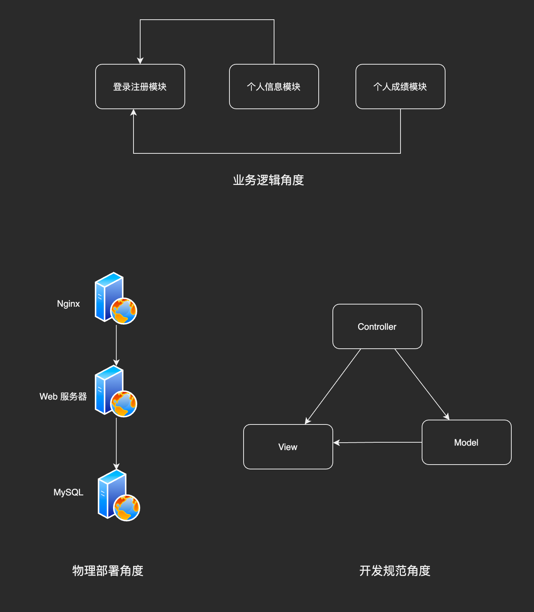

# 了解架构设计

架构设计的思维和程序设计的思维差异很大。**架构设计的关键是判断和取舍，程序设计的关键是逻辑和实现。**

## 架构指什么

“架构”这个词大家都很常见，那么：
- 准确来说架构指的是什么呢？
- 架构和框架有什么关系和不同？

为了回答这些问题，关键在于理解这几个概念：
- 系统与子系统
- 模块与组件
- 框架与架构

### 系统与子系统
#### 系统

> 系统指由一群**有关联的**个体组成，根据某种**规则**运作，能完成个别元件**不能单独完成**的工作的群体。

1. 关联：系统中的个体是有关联的，没有关联的个体不能成为一个系统。可以把发动机、地盘、轮胎和车架组合成一台汽车，但是发动机和手机放在一起不能称为一个系统。
2. 规则：系统内个体需要按照指定的规则运作，规则规定了系统内个体的分工和协作方式。例如发动机提供动力，由传动轴把动力传到轮胎，从而驱动汽车前进。
3. 单独个体不具备的能力：系统能力和个体能力有本质的区别，系统能力不是个体能力之和，而是产生了新的能力。汽车能载重前行，而发动机、轮胎本身不具备这种能力。

#### 子系统

> 子系统是由一群由关联的个体所组成的系统，多半会是更大系统中的一部分

可以看出子系统和系统的定义是一样的，只是观察的角度不同，一个系统可能是另外一个更大系统的子系统。

例如，以微信来说

1. 微信本身是一个系统，包含聊天、登录、支付、朋友圈等子系统
2. 朋友圈这个系统，又包含动态、评论、点赞等子系统
3. 评论这个系统可能又包含审核子系统、发布子系统、存储子系统
4. 评论审核系统不再包含业务意义上的子系统，而是包括了各个模块或者组件，这些功能模块或者组件本身也是另一个维度上的系统。例如，MySQL、Redis 等是存储系统，但不是业务系统。

### 模块与组件

模块和组件在实际的工作中，很容易混淆，主要是因为它们的定义不好理解，也不好区分。

> 软件模块（Module）是一套一致而互相有紧密关连的软件组织。它分别包含了程序和数据结构两部分。现代软件开发往往利用模块作为合成的单位。模块的接口表达了由该模块提供的功能和调用它时所需的元素。模块是可能分开被编写的单位。这使它们可再用和允许人员同时协作、编写及研究不同的模块。

> 软件组件定义为**自包含的、可编程的、可重用的、与语言无关的软件单元**，软件组件可以很容易被用于组装应用程序中。

就算看到这里也比较难以区分 😂，根本原因是**模块和组件都是系统的组成部分，只是从不同角度拆分系统而已。**

1. 从**逻辑角度**来拆分，得到的单元就是“模块”
2. 从**物理角度**拆分，得到的单元就是“组件”

划分模块的主要目的是职责分离，划分组件的主要目的是单元复用，它“独立且可替换”。

以一个简单学生管理系统为例：
1. 从逻辑上拆分，可以分为“登录注册模块”、“个人信息模块”、“个人成绩模块”
2. 从物理角度拆分，可以分为 Nginx、Web 服务器、MySQL

### 框架与架构

这两个概念也比较相似，工作中有时候也分不清楚。

> 软件框架（Software framework）通常指的是为了实现某个业界标准或完成特定基本任务的**软件组件规范**，也指为了实现某个软件组件规范时，**提供规范所要求之基础功能的软件产品**。

> 软件架构指软件系统的“**基础结构**”，创造这些基础结构的准则，以及对这些结构的描述。

从上面的定义中提取一些关键的部分：

- 框架是组件规范。例如，MVC 就是一种常见的开发规范，类似的还有 MVP、MVVM、J2EE 等框架。
- 框架是提供基础功能的产品。例如，Spring MVC 是 MVC 的开发框架，除了满足 MVC 的规范，Spring 提供了很多的基础功能帮助我们实现功能，包括 Spring Security、Spring JPA 等很多基础功能
- 和架构对比起来，**框架关注的是“规范”，架构关注的是“结构”**。

就算是看起来它们是不同的，平台的工作工作中还是会有些似是而非的说法。例如，我们的系统是基于 Spring MVC 框架开发，标准的 MVC 架构 ...

这里的主要原因就是，架构中的“基础结构”并没有明确以什么角度来分解，采用不同角度，可以将系统分解成不同的结构。

还是看前面的学生管理系统，从不同角度区划分，我们接可以得到不同的“架构”。

### 重新定义架构

参考前面维基百科的定义，将架构重新定义为：**软件架构指软件系统的顶层结构**。
- 第一，“系统是一群有关联的个体组层”，架构需要明确系统包含哪些“个体”
- 第二，“系统中的个体是根据某种规则运作的”，架构需要明确个体运作和协作的规则。
- 第三，这里把“基础结构”改为“顶层建筑”，更好的区分系统和子系统，避免混淆。
  
### 总结

架构是顶层设计，框架是面向编程或者配置的半成品，组件是从物理角度的拆分，模块是从业务逻辑上的划分，系统是个体之间相互协作的实体。