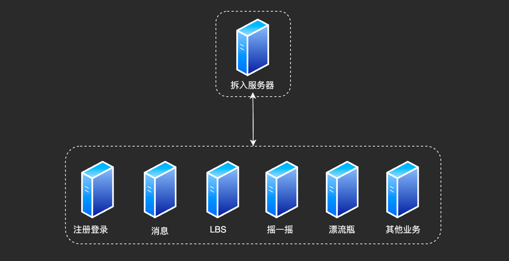

# 系统复杂度的来源

架构设计是为了解决软件系统复杂度带来的问题，接下来复杂度的主要来源。

## 高性能

最近几十年软件系统的性能飞速发展，规模也从单台扩展到上万台。软件系统中高性能带来的复杂度主要体现在两方面：
- 一方面是单台计算机内部为了高性能带来的复杂度；
- 另一方面是多台计算机集群为了高性能带来的复杂度。

### 单机复杂度

系统性能的本质是由硬件驱动的，而对硬件的性能的发挥起关键作用的就是操作系统，所以操纵系统也会跟着硬件发展而发展。操作系统是软件的运行环境，它的的复杂度直接决定系统的复杂度。

操作系统和性能相关的就是**进程和线程**。

1. 最早计算机没有操作系统，只有输入、计算和输出结果，**大部分时候计算机都在等待用户输入，效率很低**
2. 为了解决等待输入的问题，有了批处理操作系统，就是把要执行的指令预先写下来（磁带、磁盘等）**形成指令集**，也就是常说的“任务”，把这些任务交个计算机执行
3. 批处理也有明显缺点，**就是计算机一次只能执行一个任务**，如果某个任务是从 I/O 设备读取大量数据，在 I/O 操作过程中，CPU 是空闲的
4. 为了解决这个问题，进程出现了。用进程对应一个任务，每个任务又自己的内存空间，进程间互不相关，由操作系统来调度。此时 CPU 还没有多核，**为了达到多进程并行的效果，采用分时方式，即把 CP 的时间分成很多片段，每个片段只执行某个进程的执行**。从 CPU 的角度来看还是串行的，但是由于 CPU 处理速度很快，我们用户看起来，感觉多进程是并行处理的。
5. 因为多进程之间互不相关，如果两个运行的过程中不能通信，那么只能是 A 任务把结果写到存储，B 任务再从存储中读取来处理，这样不仅效率低，看起来也会更加复杂。如果任务之间能够在运行中通信事情就更加灵活高效了。为了解决这个问题，设计出了各种进程间通信的方式：管道、消息队列、信号量、共享存储等。
6. 多进程可以并行执行任务，但是**对于一个进程来说，它内部只能串行处理**。而实际上，很多进程内部的子任务并不要求养个按时间顺序执行，也可以并行处理。就这样**线程**出现了，它是进程内部的子任务，这些子任务共享同一份进程数据。另外为了保证数据正确性，又发明了互斥锁机制。
7. 有了线程之后，**操作系统调度的最小任务就变成了线程，而进程变成了操作系统分配资源的最小单位**。

多进程多线程让并行处理的性能大大提升，但本质上还是分时系统，并不能做到真正的并行。显而易见要解决这个问题，就是让多个 CPU 同时执行计算任务，从而实现真正意义上的并行。目前解决方案有 3 种：
- [SMP](https://zh.wikipedia.org/wiki/%E5%AF%B9%E7%A7%B0%E5%A4%9A%E5%A4%84%E7%90%86)（Symmetric-Multi-Processor，对称多处理器结构）
> 一种多处理器的电脑硬件架构，在对称多处理架构下，每个处理器的地位都是平等的，对资源的使用权限相同。现代多数的多处理器系统，都采用对称多处理架构，也被称为对称多处理系统（Symmetric multiprocessing system）。在这个系统中，拥有超过一个以上的处理器，这些处理器都连接到同一个共享的主存上，并由单一操作系统来控制。
- [NUMA](https://zh.wikipedia.org/wiki/%E9%9D%9E%E5%9D%87%E5%8C%80%E8%AE%BF%E5%AD%98%E6%A8%A1%E5%9E%8B)（Non-Uniform Memory Access，非一致存储访问结构）
> 是一种为多处理器的电脑设计的内存架构，内存访问时间取决于内存相对于处理器的位置。在NUMA下，处理器访问它自己的本地内存的速度比非本地内存（内存位于另一个处理器，或者是处理器之间共享的内存）快一些。
- MPP（Massive Parallel Processing，海量并行处理结构）

其中 SMP 最常见，也是最流行的。

要完成一个高性能的软件系统，那就需要考虑多进程、多线程、进程间通信、多线程并发等技术点。这些需要花费很大的精力来结合业务进行分析、判断、选择和组合。

### 集群复杂度

虽然计算机硬件在快速发展，但是相对于业务发展的速度来说还是远远不够的。例如2020 年天猫双11的订单创建峰值就达到58.3万笔/秒。

这种复杂的业务，**单机性能无论如何是无法支撑的，必须采用机器集群的方式来达到高性能**。支付宝和微信这种规模的业务系统，后台系统的机器数量都是万台级别的。

大量机器带来的性能提升，并不是增加机器这么简单，如何让这些机器之间互相配合是一个非常复杂的工作。

#### 1. 任务分配

当我们从 1 台服务器增加到 2 台时，看看任务分配的复杂性。

- **需要增加一个任务分配器**。选择任务分配器是一个复杂的事情，需要考虑性能、成本、可维护性、可用性等因素。
  - 可能是硬件设备（例如交换机）
  - 可能是软件网络设备（例如 LVS）
  - 也可能负载均衡软件（例如 Nginx）
  - 还可能是自己开发的系统
- **任务分配器和真正业务服务器之间的链接和交互**。需要选择合适的链接方式，并对连接进行管理。
  - 链接建立
  - 链接检测
  - 链接中断如何处理
- **任务分配器需要分配算法**。
  - 采用轮训算法
  - 还是按权重分配
  - 或者按照负载分配，如果按照负载，那么业务服务器还需要上报自己的负载状态给任务分配器

👆仅仅是增加 1 台业务服务器。假设一台可以处理 5000次/s 请求，那么理论上这个架构能够支撑 10000次/s 请求，**实际上有损耗，一般打 8 折**，也就是 8000次/s。

如果我们的性能要求再提高，假设要求每秒 100,000 次。是不是将业务服务器增加到 25 台就可以了呢？

这样是不行呢，因为随着业务服务器的增加，任务分配器本身又会成为性能瓶颈。任务分配器也需要扩展为多台。

这样系统就会更加复杂：

- 需要将不同用户分配到不同的任务分配器上。常见的方法有 DNS 轮询、智能 DNS、CDN、GSLB 设备（Global Server Load Balance，全局负载均衡）等
- 任务分配器和业务服务器之间的链接从简单的“1 对 多”变成了“多对多”的网状结构
- 机器数量从 3 台到 30 万台（一般分配服务器少于业务服务器，这里假设业务服务器 25 台，分配服务器为 5 台）

前面的例子都是以业务处理为例，实际上任务**除了是完整的业务处理，也可以指某个具体的任务**。例如“存储”、“运算”、“缓存”都可以作为一项任务，所以存储系统等都可以按照任务分配的方式来搭建架构。

此外，“任务分配器”也不一定只能是物理上存在的机器或者一个独立运行的程序，是可以嵌入其他程序算法中的

#### 2. 任务分解

通过任务分配，可以突破单机性能的瓶颈。但如果业务越来越复杂，单纯通过任务分配来扩展性能，收益会越来越低。

业务简单时，1 台机器扩展到 10 台，性能能有 8 倍提升，但是如果业务复杂，可能只能提升 5 倍。原因就是业务月复杂，单台机器的处理性能就会越来越低。为了继续提升性能，需要采取第二种方式：任务分解，也就是把业务服务器拆分成更多组成部分。

在上面的结构示意图中，微信后台结构从业务逻辑上将各个子业务进行拆分，包括：注册登录、摇一摇等。

这种方式，把大一统但复杂的业务拆分成小而简单但需要多个系统配合的业务系统。任务分解既不会减少功能，也不会减少代码（实际上可能还会增加），那为何通过任务分解可以提升性能呢：

- **简单的系统更加容易做到高性能**
  - 系统功能简单，影响性能的点更少，更加容易进行针对性优化。
  - 系统复杂的话，比较难找到关键性能点，因为需要考虑和验证点太多。另外可能把 A 关键点性能提升了，但是无意中 B 性能点降低了，最后整个系统的性能没有提升，反而下降了。
- **可以针对单个任务进行扩展**
  - 子系统有性能问题时，只需要针对它进行对应的优化即可，风险小
  - 以微信为例，如果用户增长太快，注册登录的子系统的性能出现瓶颈，只需要优化登录注册子系统的性能（代码优化或者粗暴增加机器），而其他子系统消息、LBS 完全不需要改动

但是注意，**将大系统划分成子系统能够提升性能，但并不是划分的越细越好**。

前面微信后台目前是 7 个子系统，我们把它再细分一下，划分为 100 个子系统，性能会增加吗？

这样做性能反而会下降。**系统拆分的越细，为了完成某个业务，系统间的调用次数就会呈指数级别上升**，而系统间的调用通道目前都是通过网络传输，性能远比系统内的函数调用低得多。

假设请求和响应的网络时间耗费 1ms，业务逻辑本身 50 ms，且任务拆解不影响业务逻辑时间，那么处理一次用户请求的时间：
- 拆分为 2 个子系统，需要 51ms
- 拆分成 100 个子系统，系统间的请求 99 次，需要 149 ms

虽然系统拆分可以提升业务的处理性能，但是提升是有上限的。最终的决定业务处理性能还是在业务逻辑本身，业务逻辑本身没有发生大的改变下，理论上性能是有个极限的，拆分系统只能让性能逼近这个极限。因此任务分解带来的收益是有个度的，并不是越细越好。