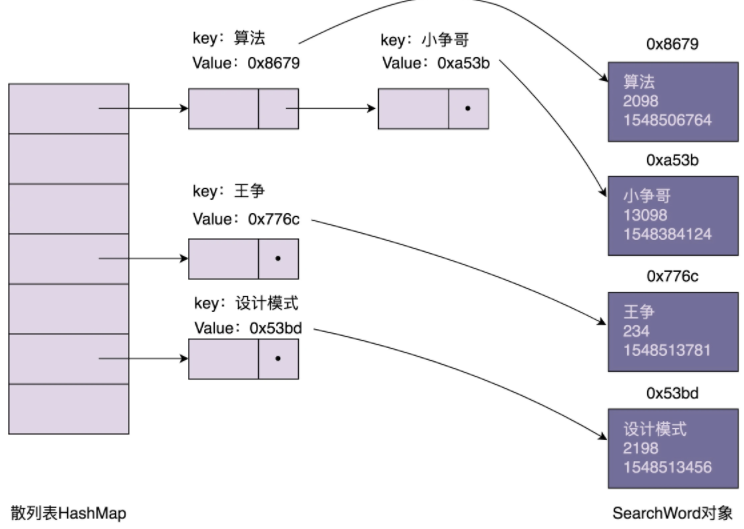
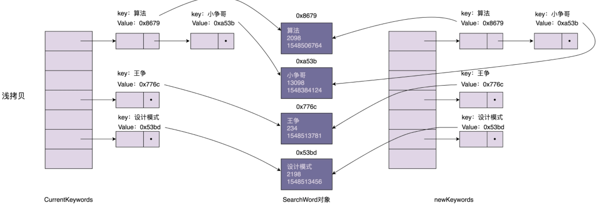
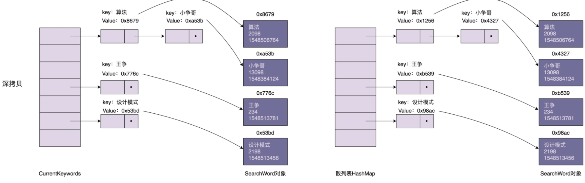

# 原型模式

前面已经介绍了单例模式、工厂模式、建造者模式，今天我们来讲最后一个：原型模式。

对于前面来说，原型模式是已经比较常用的开发模式，即使现在 es6 引入了 class，但是它也只是基于原型的语法糖。

接下来不和某一语言语法机制相关，而是通过一个 clone 散列表的例子带你搞清楚：**原型模式的应用场景，以及它的两种实现方式：深拷贝和浅拷贝**。

## 原型模式的原理与应用

如果对象的**创建成本比较大**，而同一个类的**不同对象之间差别不大**（大部分字段都相同），在这种情况下，我们可以利用**对已有对象**（原型）进行**复制**（或者叫拷贝）的方式来创建新对象，以达到**节省创建时间**的目的。这种基于原型来创建对象的方式就叫作**原型设计模式**（Prototype Design Pattern），简称**原型模式**。

### 何为创建成本比较大

一般，创建对象包括申请内存，给成员变量赋值，这一过程**本身不会花费太多时间**。对于大部分系统来说，这点时间完全可以忽略。使用复杂的模式，只是得到一点点性能的提升，这就是所谓的过度设计，得不偿失。

但是如果创建对象需要**经过耗时的操作**，例如复杂的计算（例如排序，计算哈希值），或者需要从 RPC、网络、数据库、文件系统等非常慢速的 IO 中读取，这种情况下，就可以利用原型模式，从其他已有对象中直接拷贝得到，而不用每次再创建新的对象，重复执行这些耗时操作。

### 通过一个例子来解释一下刚刚这段话

- 需求背景

假设数据库存储 10w 条“搜索关键词”信息，每条包含关键词、关键词被搜索的次数、信息最近更新的时间。

v2
关键词 | 次数 | 更新时间
---------|----------|---------
 算法 | 2033 | 1548506764
 设计模式 | 7867 | 1548506344
 ... | ... | ...

系统 A 在启动的时候会加载这份数据到内存中，用户处理相关业务需求。为了方便快速查找某个关键词对应的信息，给关键词建立一个散列表索引。

另外，还有一个系统 B，专门用来分析搜索日志，定期（比如间隔 10 分钟）批量的更新数据库的数据，并且标记为最新的数据版本。

v3
关键词 | 次数 | 更新时间
---------|----------|---------
 算法 | 2033 | 1548506764
 设计模式 | **9000** | **1548509453**
 ... | ... | ...

- 为了保证系统 A 数据的实时行（不一定非常实时单不能太久），系统 A 需要定期更新数据的数据，更新内存中，怎么实现这个需求？

只需要在系统 A 中，记录当前数据的版本 V2 对应的更新时间 T2，从数据库中捞出更新时间大于 T2 的所有搜索关键词，也就是找出 V2 版本与最新版本数据的“差集”，然后针对差集中的每个关键词进行处理。

如果已经在散列表中，就更新相应的搜索次数、更新时间等信息；如果它不在散列表中，就将它插入散列表中。

- 任何时刻，系统 A 中的所有数据都必须是同一个版本的，要么都是版本 a，要么都是版本 b，不能有的是版本 a，有的是版本 b。另外还要求，在更新内存数据的时候，系统 A 不能处于不可用的状态，也就是不能停机更新数据。怎么实现？

首先，我们把正在使用的数据的版本定义为“服务版本”，然后更新内存中数据的时候，并不是直接在服务版本（v2）上更新，而是重新创建另外一个版本（v3），等新的版本数据建好之后，再一次性地将服务版本从 v2 切换到 v3。

这样就保证数据一直可用，又避免了中间状态的存在。

- 但是重新创建一个版本耗时会很高，需要从数据库中读出这 10w 条数据，然后还需要计算哈希值，构建新的哈希表。怎么解决耗时的问题呢？

为了提高效率，原型模式就派上用场了。

我们直接将当前的哈希表**复制到**新的哈希表，然后从数据库捞出新增或者有更新的关键词，更新到新的哈希表中。相对于新建 10w 来说，每次新增/更新的关键词还是比较少的，所以这样就大大提高了数据更新的效率。

不过这样容易有一个问题，理解这个问题就需要先了解：深拷贝（Deep Copy）和浅拷贝（Shallow Copy）

## 原型模式的实现方式深拷贝和浅拷贝

内存中，散列表的结构大致如下。散列表索引中，每个结点存储的 key 是搜索关键词，value 是 SearchWord 对象的内存地址。SearchWord 对象本身存储在散列表之外的内存空间中。

### 深拷贝浅拷贝的区别

浅拷贝和深拷贝的区别在于：

- 浅拷贝只会复制图中的索引（散列表），不会复制数据（SearchWord 对象）本身。浅拷贝得到的对象（newKeywords）跟原始对象（currentKeywords）共享数据（SearchWord 对象）
- 相反，深拷贝不仅仅会复制索引，还会复制数据本身。深拷贝得到的是一份完完全全独立的对象。

前面的实现中，将当前哈希表直接复制到新的哈希表。这样当我们去更新新的哈希表中 SearchWord
 对象的时候，因为指向的都是一个 SearchWord，就会导致当前哈希表的数据也被更新，也就是当前哈希表同时通常两个版本的数据！

为了解决这个问题，我们可以将浅拷贝替换为深拷贝。不仅仅复制索引，还把 SearchWord 也复制一份出来。

### 实现深拷贝

如何实现深拷贝呢？总结一下的话，有下面两种方法。

- 第一种方法：递归拷贝对象

递归拷贝对象...，直到要拷贝的对象只包含基本数据类型数据，没有引用对象为止。

- 第二种方法：先将对象序列化，然后再反序列化成新的对象。
