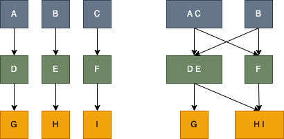

# LOD

最后一个设计原则：**迪米特法则**，尽管它不像 SOLID、KISS、DRY 原则那样，人尽皆知，但它却非常实用。利用这个原则，能够帮我们实现代码的“**高内聚、松耦合**”。

## 什么是“高内聚、松耦合”

“高内聚、松耦合”是一个非常重要的设计思想，能哦股有效提高代码的**可读性和可维护性**，缩小功能改动设计的代码范围。

它是一个比较通用的设计思想，可以用来指导**不同粒度代码**的设计与开发，比如系统、模块、类，甚至是函数。也可以应用到**不同的开发场景**，比如微服务、框架、组件鞥。

接下来从“类”的角度进行分析。“高内聚”用来知道类本身的设计，“松耦合”用来指导类与类之间的依赖关系的设计。高内聚有助于松耦合，松耦合有需要高内聚的支持。

### 到底什么是“高内聚”

所谓高内聚，**就是指相近的功能应该放到同一类中，不相近的功能不要放到同一类中**。相近功能往往倍同时修改，放到同一个类中，修改会比较集中，代码容易维护。

前面的**单一职责是实现高内聚非常有效的设计原则**。

### 又什么是“松耦合”

所谓的松耦合是说，在代码中，**类与类之间的依赖关系简单清晰**。即使两个类有依赖关系，一个类的代码改动不回或者很少导致依赖类的代码改动。

前面的**依赖注入、接口隔离、基于接口而非实现编程，以及现在的迪米特法则，都是为了实现代码的松耦合**。

### “内聚”和“耦合”的关系

“高内聚”有助于“松耦合”，同理，“低内聚”会导致“紧耦合”。



- 左边：类的粒度较小，职责单一。相近功能放到一个类中，类更加独立，代码内聚性更好。因为职责单一，每个类依赖较少，代码耦合低。
- 右边：相反，类的粒度较大，低内聚，功能大而全。不想尽的功能放到一个类中，导致很多其他类依赖这个类。当我们修改这个类的某个功能时，会影响依赖它的多个类。我们需要测试这些类是否还能正常工作，这就是所谓的“牵一发动全身”。

高内聚、低耦合的代码结构更加简单、清晰，相应地，在可维护性和可读性上确实要好很多。

## “迪米特法则”理论描述

迪米特的英文翻译时：Law of Demeter，缩写是 LOD。单从这个名字上看不出它讲什么，不过，它有个更加达意的名字，叫作**最小知识原则**，英文翻译为 The Least Knowledge Principle。

英文定义：

> Each unit should have only limited knowledge about other units: only units “closely” related to the current unit. Or: Each unit should only talk to its friends; Don’t talk to strangers.

翻译成中文就是：

> 每个模块（unit）只应该了解那些与它关系密切的模块（units: only units “closely” related to the current unit）的有限知识（knowledge）。或者说，每个模块只和自己的朋友“说话”（talk），不和陌生人“说话”（talk）。

还是比较抽象，想要灵活应用还需要实战经验的积累。结合经验，重新描述一下（为了统一把“模块”替换成“类”）：

> 不该有直接依赖关系的类之间，不要有依赖；有依赖关系的类之间，尽量只依赖必要的接口（也就是定义中的“有限知识”）。

从上面的定义可以看出，迪米特法则包含前后两个部分。接下来结合实例进行说明。

## 不该有直接依赖关系的类之间，不要有依赖

先来看这条原则中的前半部分，“不该有直接依赖关系的类之间，不要有依赖”。

看一个例子：简化版的搜索引擎爬取网页的功能。代码中包含三个类：

- NetworkTransporter 类负责底层网络通信，根据请求获取数据；
- HtmlDownloader 类用来通过 URL 获取网页；
- Document 表示网页文档，后续的网页内容抽取、分词、索引都是以此为处理对象。

```java

public class NetworkTransporter {
    // 省略属性和其他方法...
    public Byte[] send(HtmlRequest htmlRequest) {
      //...
    }
}

public class HtmlDownloader {
  private NetworkTransporter transporter;//通过构造函数或IOC注入
  
  public Html downloadHtml(String url) {
    Byte[] rawHtml = transporter.send(new HtmlRequest(url));
    return new Html(rawHtml);
  }
}

public class Document {
  private Html html;
  private String url;
  
  public Document(String url) {
    this.url = url;
    HtmlDownloader downloader = new HtmlDownloader();
    this.html = downloader.downloadHtml(url);
  }
  //...
}
```

这段代码能用，但是它不够好用。

- 首先，NetworkTransporter 类依赖不该有直接依赖关系的 HtmlRequest 类

作为一个底层网络通信类，我们希望它尽可能通用，而不是只服务于下载 HTML。所以**不该直接依赖太具体的发送对象** HtmlRequest。**从一点上这个类设计违反了迪米特法则，依赖了不该有直接依赖关系的 HtmlRequest 类**。

如何重构呢？

有个形象的比喻，假如你现在去商店买东西，你肯定不回直接把钱包给收银员，让收银员从里面拿钱。而是你从钱包把钱拿出来交给收银员。

这里 HtmlRequest 相当于钱包，HtmlRequest 里面的 address 和 content 相当于钱，NetworkTransporter 相当于收银员。我们应该把 address 和 content 交个 NetworkTransporter，而非直接把 HtmlRequest 交给它。

所以重构如下：

```java
public class NetworkTransporter {
    // 省略属性和其他方法...
    public Byte[] send(String address, Byte[] data) {
      //...
    }
}
```

- 再来看 HtmlDownloader 类，没啥问题，根据前面的重构修改一下使用方式就可以

```java
public class HtmlDownloader {
  private NetworkTransporter transporter;//通过构造函数或IOC注入
  
  // HtmlDownloader这里也要有相应的修改
  public Html downloadHtml(String url) {
    HtmlRequest htmlRequest = new HtmlRequest(url);
    Byte[] rawHtml = transporter.send(
      htmlRequest.getAddress(), htmlRequest.getContent().getBytes());
    return new Html(rawHtml);
  }
}
```

- 最后，我们来看下 Document 类，问题较多

第一，构造函数中的 downloader.downloadHtml() 逻辑复杂，耗时长，不应该放到构造函数中，会影响代码的可测试性。
第二，HtmlDownloader 对象在构造函数中通过 new 来创建，违反了基于接口而非实现编程的设计思想，也会影响到代码的可测试性。
第三，从业务含义上来讲，Document 网页文档没必要依赖 HtmlDownloader 类，违背了迪米特法则。

## 有依赖关系的类之间，尽量只依赖必要的接口

再来看一下这条原则中的后半部分：“有依赖关系的类之间，尽量只依赖必要的接口”。

还是结合一个例子来讲解。下面这段代码非常简单，Serialization 类负责对象的序列化和反序列化。

```ts
class Serialization {
  private static IDENTIFIER_STRING: string = "UEUEUE;";
  private gson;
  
  constructor() {
    this.gson = new Gson();
  }
  
  serialize() {
    const textBuilder = new StringBuilder();
    textBuilder.append(IDENTIFIER_STRING);
    textBuilder.append(gson.toJson(object));
    return textBuilder.toString();
  }
  
  deserialize(text: string) {
    if (!text.startsWith(IDENTIFIER_STRING)) {
        return Collections.emptyMap();
    }
    const gsonStr = text.substring(IDENTIFIER_STRING.length());
    return gson.fromJson(gsonStr, Map.class);
  }
}
```

单看这个类的设计，没有一点问题。

不过如果放到一定的场景里，还有优化空间。假设在我们项目中，有些类只用到序列化操作，另一些类只用到反序列化操作。基于迪米特法则后半部分“有依赖关系的类之间，尽量只依赖必要的接口”，只用到序列化的那部分类不应该依赖反序列化接口，反之一样。

根据这个思路，将 Serialization 拆分成两个小粒度的类：一个负责序列化，一个负责反序列化。

```ts
class Serialize {
  private static IDENTIFIER_STRING: string = "UEUEUE;";
  private gson;
  
  constructor() {
    this.gson = new Gson();
  }
  
  serialize() {
    // ...
  }
}

class Deserializer {
  private static IDENTIFIER_STRING: string = "UEUEUE;";
  private gson;
  
  constructor() {
    this.gson = new Gson();
  }
  
  deserialize(text: string) {
    // ...
  }
}

```

不过！**尽管拆分之后的代码更能满足迪米特法则，但却违背了高内聚的设计思想**。高内聚要求相近的功能要放到同一个类中，这样可以方便功能修改的时候，修改的地方不至于过于分散。

如果我们既不想违背高内聚的设计思想，也不想违背迪米特法则，那我们该如何解决这个问题呢？

通过引入**两个接口**就能轻松解决这个问题，代码如下：

```ts
interface Serializable {
  serialize: (object) => string
}

interface Deserializable {
  deserialize: (text: string) => string
}

class Serialization implements Serializable, Deserializable {
  private static IDENTIFIER_STRING: string = "UEUEUE;";
  private gson;
  
  constructor() {
    this.gson = new Gson();
  }
  
  serialize() {
    const textBuilder = new StringBuilder();
    textBuilder.append(IDENTIFIER_STRING);
    textBuilder.append(gson.toJson(object));
    return textBuilder.toString();
  }
  
  deserialize(text: string) {
    if (!text.startsWith(IDENTIFIER_STRING)) {
        return Collections.emptyMap();
    }
    const gsonStr = text.substring(IDENTIFIER_STRING.length());
    return gson.fromJson(gsonStr, Map.class);
  }
}

class DemoClass_1 {
  private serializer;

  constructor(serializer: Serializable) {
    this.serializer = serializer;
  }
}
```

尽管我们还是要往 DemoClass_1 的构造函数中，传入包含序列化和反序列化的 Serialization 实现类，但是，我们依赖的 Serializable 接口只包含序列化操作，**DemoClass_1 无法使用 Serialization 类中的反序列化接口，对反序列化操作无感知，这也就符合了迪米特法则后半部分所说的“依赖有限接口”的要求**。

上面的的代码实现思路，也体现了“基于接口而非实现编程”的设计原则，结合迪米特法则，我们可以总结出一条新的设计原则，那就是“**基于最小接口而非最大实现编程**”。

## 辩证思考与灵活应用

对于上面的例子，你是不是觉得这个拆分有点过度设计的意思？

整个类只包含序列化和反序列化两个操作，只用到序列化的使用者，感知到还有一个反序列化的方法问题应该也不大。为了满足迪米特法则，将这样一个简单的类拆分成两个接口是否合适？

**设计原则本身没有错，主要是能否用对。不要为了用设计原则而用设计原则**。要结合具体问题具体分析。

刚刚这个例子，如果只是包含两个操作，确实没有太大必要进行拆分。但是如果 Serialization 添加更多功能呢？

```ts
class Serialization {
  serialize() {}
  serializeMap() {}
  serializeList() {}

  deserialize() {}
  deserializeMap() {}
  deserializeList() {}
}
```

这种场景下，拆开的思路更好。大部分代码只用到序列化方法，那么没必要了解反序列化的知识。现在反序列化的“知识”，从一个函数变成了三个，如果不拆分，一旦任一反序列化操作有代码改动，我们都需要检查、测试所有依赖 Serialization 类的代码是否还能正常工作。

为了减少耦合和测试工作量，应该按照迪米特法则，将功能隔离开。
