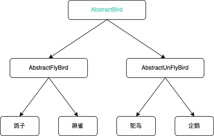
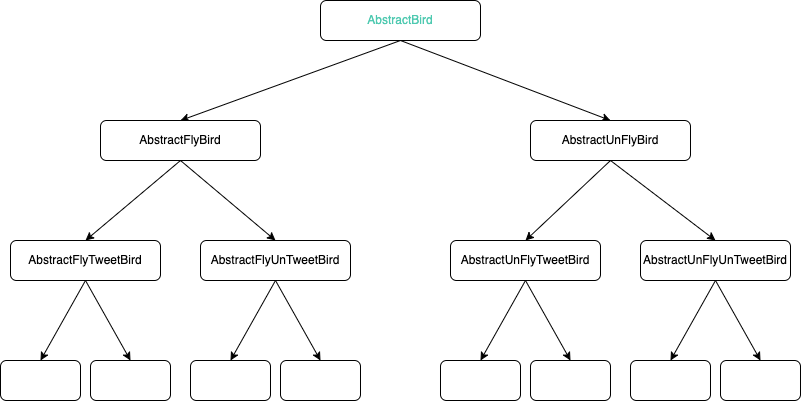

# 面向对象是什么

## 什么是面向对象编程

面向对象对象编程是一种编程范式（风格）：
- 以类或对象作为组织代码的基本单元；
- 将封装、抽象、继承和多态作为代码设计和实现的基础。

## 什么语言是面向对象的语言

相对应的，面向对象编程语法需要：
- 支持类或者对象的语法机制；
- 有语法机制能方便的实现面向对象的四大特性封装、抽象、继承和多态。

### 怎么判断是否是面向对象语言

1. 如果不按照严格的定义，大部分语言都是面向对象编程语言。
例如 JS 不支持封装和继承，按照严格意义它不算面向对象编程语言，但是某种意义上他也是面向对象的编程语言。
2. 从面向对象编程的字面上，最简单、最原始的方式就是将对象或类作为代码组织的基本单元，来进行编程的一种编程方式（风格）。
是否有现成语法支持面向对象的四大特性、是否对四大特性有所取舍，可以不作为标准。

### 面向对象编程和面向对象编程语言之间的关系

1. 面向对象编程一般使用面向对象编程语言来进行，但是不用面向对象编程语言照样可以面向对象编程
2. 反过来，我们使用面向对象编程语言，写出来的代码也不一定是面向对象风格，而是面向过程风格。

## 四大特性封装、抽象、继承、多态是什么解决了什么问题

理解面向对象，关键是理解其四大特性：封装、抽象、继承、多态。对于这四大特性，光理解它们的定义是不够的，还需要知道每个特性的意义和目的，以及解决了什么问题。

### 封装

#### 定义

- 封装也叫作信息隐藏或者数据访问保护。类通过暴露有限的访问接口，授权外部**仅能通过类提供的方式（或者叫函数）来访问内部信息或者数据**。
- 封装不是拒绝访问，而是限制访问。单纯的属性私有化不能称为封装

```typescript
interface personOptions {
  name: string;
  height: number;
  age: number;
}

class Person {
  public name: string;
  public height: number;
  private age: number;

  constructor(options: personOptions) {
    const { name, height, age} = options;
    this.name = name;
    this.height = height;
    this.age = age;
  }

  getName() {
    return this.name;
  }

  getHeight() {
    return this.height;
  }

  getAge() {
    return this.age;
  }

  setHeight(height: number) {
    this.height = height;
  }
}

const person = new Person({
  name: 'John',
  height: 175,
  age: 20
})

person.age; // Property 'age' is private and only accessible within class 'Person'.
```

对 `age` 属性的访问进行了限制，只能通过 getAge 进行访问。封装这个特性，需要编程语言提供一定的语法机制来支持，这个语法支持就是访**问权限控制**。

#### 意义和解决的问题

1. 提升可维护性：如果不对属性访问做限制，那任何代码都可以访问、修改属性，虽然更灵活，但是也更不可控，修改的逻辑散落在各个地方，最后不知道哪里改了数据
2. 提升易用性：如果直接把属性暴露给调用者，调用者想修改这些属性，就需要对业务细节有足够的理解，这也是一种负担。将属性封装起来，暴露必要的方法给调用方，这样就不用关注太多细节了。

### 抽象

#### 定义

- 封装主要讲的是如何隐藏信息、保护数据；
- 而抽象讲的是如何隐藏方法的具体实现，让调用者只需要**关心提供了哪些功能**，并不需要知道这些功能是如何实现的。

使用编程语言中的接口类 `interface` 就可以实现抽象这一特性

```ts
interface Pingable {
  ping(): void;
}
 
class Sonar implements Pingable {
  ping() {
    console.log("ping!");
  }
}
```

调用者在调用 `Pingable` 就可以了解它提供了那些方法，不需要去了解具体实现逻辑。但是不使用 `Pingable`，`Sonar` 类本身也满足抽象特性，因为类的方法是通过“函数”实现的，通过函数实现具体逻辑，这本身就是一种抽象。

#### 意义和解决的问题

- 过滤掉不必要关注的信息。人脑能承受的信息复杂程度是有限的，通过抽象，可以帮助我们过滤掉需要非必要的信息
- 提升可维护性、可扩展性。换个角度，我们在定义方法的时候也要有抽象思维，不要在方法定义中暴露太多细节（但是也不能太宽泛），这样后面如果我们需要修改方法实现不用去修改定义。`getPictureUrl` 就比 `getAliyunPictureUrl` 好。
- 抽象作为一种宽泛的设计思想，对代码设计起到重要的指导作用。很多设计原则都体现这种原则：开闭原则、代码解耦

### 继承

#### 定义

- 继承是用来表示类之间的 is-a 关系，比如猫是一种哺乳动物。
- 从继承关系上来讲，继承可以分为两种模式，单继承和多继承。单继承表示一个子类只继承一个父类，多继承表示一个子类可以继承多个父类，比如猫既是哺乳动物，又是爬行动物。

```ts
class Person {
  public name: string;
  public height: number;
  private age: number;

  constructor(options: personOptions) {
    const { name, height, age} = options;
    this.name = name;
    this.height = height;
    this.age = age;
  }
}

class Student extends Person {
  constructor(options) {
    super(options);
    this.number = options.number;
  }
}
```

#### 意义和解决的问题

- 继承最大的一个好处就是代码复用。如果两类有相同的属性和方法，就可以将它们抽取到父类，并让两个子类继承父类
- 符合人类认知，从代码设计角度来说也是一种结构美感。学生是人，从人类认知角度来说，是一种 is-a 关系，非常符合我们认知。
- 继承很好理解，但是继承层次过审就会导致可读性、可维护性变差。

### 多态

#### 定义

- 同一操作作用于不同的对象，可以有不同的解释，产生不同的执行结果。
- 多态和重载最大的区别在于参数的上，前者参数必须一致，后者可以重载扩展。

```ts
abstract class Person {
  public name: string;
  constructor(options) {
    this.name = options.name
  }
  // 不实现任何代码，子类实现
  abstract say(number: number): void;
}

class Student extends Person {
  public number: number;
  constructor(options) {
    super(options);
    this.number = options.number;
  }

  say(number: number) {
    console.log('学生的编号是' + number);
  }
}

class Teacher extends Person {
  public number: number;
  constructor(options) {
    super(options);
    this.number = options.number;
  }

  say(number: number) {
    console.log('老师的编号是' + number);
  }
}

// 也可以是使用 interface
interface PersonInterface {
  say(number: number): void;
}
class Student implements PersonInterface {
  say(number: number): void {
    // ...
  }
}
```

#### 意义和解决的问题

- 提升代码可维护性复用性（?）
- 是很多设计模式、设计原则的实现基础。例如策略模式、依赖倒置原则等

## 面向对象比面向过程好在哪

### 什么是面向过程编程与面向过程编程语言

#### 面向对象

回归一下前面的内容

- 面向对象编程：就是以类或对象作为组织代码的基本单元，并将封装、抽象、继承、多态作为代码设计和实现的基础
- 面向对象编程语言：支持类或对象，并有现场的语法机制，能方便实现四大特性封装、抽象、继承、多态

#### 面向过程

类比一下，我们就可以得出面向过程的定义

- 面向过程编程：也是一种编程范式（风格），它以**过程**（可以理解为方法、函数、操作）作为组织代码的基本单元，以**数据**（可以理解为变量、属性）与方法相分离为主要特点。是一种**流程化**的编程风格，通过拼接一组操作数据完成一项功能。
- 面向过程编程语言：最大特点是**不支持类和对象**两个语法概念，不支持丰富的面向对象特性（比如封装、抽象、继承），仅支持面向过程编程。

#### 区别

它们最基本的区别是代码的组织方式不同

- 面向过程的代码被组织成了一组方法集合及其数据结构，方法和数据结构的定义是分开的。
- 面向对象的代码被组织成一组类，方法和数据结构被绑定在一起。

### 面向对象有哪些优势

面向过程先出现，面向对象为什么能成为主流的编程范式？和面向过程相比到底有什么优势？

- OOP 更加能够应对大规模复杂程序的开发
  - 它们的代码实现其实差不多，只是组织方式不同，一般情况下没有感觉明显的优势！
  - **如果需求足够简单，那么处理流程只有一条线，通过划分成不同的几个步骤，并翻译成代码，这种非常适合面向过程来实现！**
  - 但是如果是大规模的程序开发，整个处理流程并不是一条线而是错综复杂的，是一个网状结构。
    - 如果按照面向过程这种流程化的思维去“翻译”这个网状结构，**去思考如何将程序拆分成一组程序执行的方法，会比较吃力**！
    - 面向对象则是以类为思考对象，先去思考业务如何建模，如何将需求翻译为类，如何给这些类建立交互关系，而完成这些并不需要考虑错综复杂的流程。**有了类的设计之后，就可以像搭积木一样，按照不同流程组装形成整个程序**。
  - 面向对象通过类也提供一种更清晰、更加模块化的代码组织方式。例如我们一个广告系统业务逻辑复杂、代码量很大，数百个函数、数据结构怎么组织才能不凌乱呢？类就是一种很好的方式。当然通过将不同函数、数据结构放到不同的文件（JS 的方式）也可以达到这种效果，但是这并不是强求的，面向对象将强制你这么去做。

- OOP 风格的代码更易复用、易扩展、易维护
  - 封装：面向对象将数据和方法绑定在一起，通过对访问权限的控制，只允许外部调用类暴露的方法有限的访问数据，不向面向过程那些可以任意方法修改，更有利于维护
  - 抽象：我们知道函数本身也是抽象，隐藏了具体的实现。从这一点来说面向过程和面向对象都是支持的，但是面向对象的编程还提供了其他抽象方式，例如基于接口实现的抽象，可以让我们不改变原有实现的情况下轻松替换新的实现逻辑，提高可扩展性
  - 继承：可以将两个类公共的方法，抽取到父类，并让两个字类继承父类，提高代码的复用性
  - 多态：

- OOP 语言更加人性化、更加高级、更加智能
  - 在语言的发展历史中，当使用二进制指令、汇编语言、面向过程编程语言时，我们在思考，如何设计一组指令，告诉机器去执行，操作某些数据，完成我们任务
  - 而面向对象编程时，我们在思考，如何给业务建模，如何将真实世界映射为类或对象，这让我们更聚焦在业务本身，而不是思考如何跟机器打交道。更加人性化、更加高级、更加智能。

### 这些代码看似时面向对象实际是面向过程

不是把所有代码都塞到类里，自然就是进行面向对象编程了。有的代码表面看是面向对象，本质却是面向过程。接下来结合实例分析一下，另外也思考两个问题：为什么我们容易写出这种代码？面向过程是否真的是无用武之地了？

#### 滥用 getter、setter 方法

有时候我们定义属性，就顺手把这些属性的 getter、setter 都定义上。这些方法可能以后会用上，并且也无伤大雅。

```ts
class Person {
  private name: string;
  private age: number;
  private hobbyList: Array<string>;
  
  constructor(options) {
    this.name = options.name;
    // ...
  }
  getName() { return this.name }
  setName(name) { this.name = name }
  getAge() { return this.age }
  setAge(age) { this.age = age }
  getHobby() { return this. hobbyList }
  addHobby(hobby) { this.hobbyList.push(hobby) }
}
```

- 面向对象封装的定义是：通过访问权限控制，隐藏内部数据，外部只能通过提供的方法进行访问、修改数据
- 暴露不应该暴露的方法，明显违反面向对象的封装特性，相当于数据没有了访问控制，任何代码都可以访问修改它。`name`、`age` 都是 `private`，但是都定义了 `get`、`set` 导致可以随便修改。
- 没有对返回的数据做任何防范，相当于不做限制。`getHobby` 返回一个 array，这样就可以直接通过 `push`、`pop` 等方法直接进行修改。

#### 滥用全局变量和全局方法

在面向对象编程风格中，数据和方法时通过类来组织的。滥用全局变量和全局方法，会违反这个风格。

常见就是和配置相关的全局常量，和各种方法 Utils，这些方法一般和数据是分离的，是典型的面向过程风格。

- **Constants 类**

```ts
class Constants {
  static MAX_TOTAL = 50;
  static MIN_IDLE = 20;
  // ...
}
// 实际一般会这么写
export const Config = {
  MAX_TOTAL: 50,
  MIN_IDLE: 20
  // ...
}
```

把程序中所有用到的常量，都集中到这个 Constants 中不是一个好思路：
  - 降低可维护性：所有人都修改这个类，后面找起来费劲，也容易冲突
  - 增加代码编译时间：包含很多变量，依赖它的代码也就会很多。那么每次修改，都导致依赖的文件重新编译，需要更多时间
  - 影响复用性：就算我们只依赖一小部分变量，复用的时候还是需要把整个类引入

改进这个设计有两个思路：

  - 将 Constants 拆分成更加单一的多个类：例如和打包配置相关的、和接口请求相关的
  - 另外一个更好的思路是内聚（看实际是否是多个地方用到了）：不单独设计 Constants，而是哪个类用到某个变量，就把这个变量定义到这个类中，接口调用需要接口请求相关的配置，就把它定义到接口调用中，提高类设计的内聚性和代码复用。


- **Utils**

Utils 出现的背景是，我们有两个类 A 和 B，都用到一块相同的功能，为了避免代码重复，我们不应该在两个类中重复实现。

这个时候怎么办？也需要我们想到了继承，把这个方法定义到父类中，但是 A、B 与父类在业务上可能不是继承关系！这样设计不合理。

所以自然而然的我们就把它定义为 Utils 了。这虽然是彻彻底底的面向过程编程，但是并不是我们要杜绝 Utils 类了。**面向对象编程并不完全排斥面向过程的代码**。

我们可以改进一下：

  - 定义 Utils，问一下自己是否真的需要，如果是就大胆使用
  - 类比 Constants 做拆分：FileUtils、StringUtils

#### 定义数据和方法分离的类

这么明显谁会这样写呢？

传统的 MVC 结构分为 Model 层、Controller 层、View 层这三层。在做前后端分离之后，在后端开发中会稍微有些调整，被分为 Controller 层、Service 层、Repository 层。

- Controller：负责暴露接口给前端
- Service ：负责核心业务逻辑
- Repository ：负责数据读写


而在每一层中会相应定义 VO（View Object）、BO（Business Object）、Entity。一般情况下 VO、BO、Entity 只定义数据不会定义方法，所有操作这些数据的逻辑都定义在对应的 Controller 类、Service 类、Repository 中。

这就是典型的面向过程风格，实际上这种模式叫基于**贫血模型**的开发模式。

<nx-tip text="贫血模型？"/>

#### 为什么在面向对象编程中容易写出面向过程的代码

主要原因有两个：

- 面向过程更符合我们的思维：回想一下，生活中我们要完成一个任务，总会思考先做什么、在做什么，通过一系列顺序执行的操作，完成这个任务。这种面向过程的风格非常符合我们思维，而面向对象则是**自底向上**，不按照流程分解任务，而是将任务拆分成模块（类），最后再组装。
- 面向对象编程更难：面向对象编程类设计需要技巧，也需要经验。需要思考如何封装数据、设计类和类之间的关系等

所以平台开发中，我们容易不由自主的写出面向过程的风格。

#### 面向过程完全没用了么

不是抵制面向过程。

- 面向过程编程是面向对象编程的基础，面向对象编程离不开基础的面向过程编程。为什么这么说？仔细想想，类中每个方法的实现逻辑，不就是面向过程风格的代码吗？
- 面向对象和面向过程两种编程风格，不是非黑即白、完全对立的。一些标准开发库（JDK）也有面向过程代码。
- 最终的目的还是写出易维护、易读、易复用、易扩展的高质量代码，在掌控范围内，使用哪种都可以。

## 接口和抽象类

接口和抽象类是面向对象和很多设计模式、设计原则编程实现的基础。

### 它们是什么区别在哪里

#### 抽象类

```ts
abstract class Person {
  public name: string;
  constructor(options) {
    this.name = options.name
  }
  write() {
    console.log('学生的编号是', this.name)
  }
  // 不实现任何代码，子类实现
  abstract say(number: number): void;
}

class Student extends Person {
  public number: number;
  constructor(options) {
    super(options);
    this.number = options.number;
  }

  say(number: number) {
    console.log('学生的编号是' + number);
  }
}

class Teacher extends Person {
  public number: number;
  constructor(options) {
    super(options);
    this.number = options.number;
  }

  say(number: number) {
    console.log('老师的编号是' + number);
  }
}
```

通过上面的例子，总结抽象类具有三个特性：

- 抽象类不能被实例化，只能被继承。也就是说你不能去 new 一个抽象类出来，会报错（内部抽象的方法等都是没有实现的，不能执行）
- 抽象类可以包含属性和方法。方法既可以包含代码实现（例如 `write`），也可以不包含代码实现（例如 `say`）
- 子类继承抽象类，必须实现抽象类中的所有抽象方法。对立例子，子类都需要实现 `say` 方法。

### 接口

```ts
interface Pingable {
  ping(): void;
}
 
class Sonar implements Pingable {
  ping() {
    console.log("ping!");
  }
}
```
通过 `interface` 定义一个 `Pingable` 接口，`Sonar` 是接口的实现类，实现了 `ping` 功能。

通过上面的例子，总结接口具有三个特性：

- 方法不能包含代码实现
- 类实现接口的时候，必须实现接口中生命的所有方法

### 有什么区别

除了语法特性的区别，从设计的角度，两者区别也比较大：
- 抽象类实际上就是类，也表示 is-a：这种类比较特殊，它不能被实例化只能被继承。而继承是一种 is-a 的关系，所以抽象类也表示一种 is-a 的关系。
- 相对来说，接口表示一种 has-a 关系：表示具有某项功能。对于接口，更形象的叫法是“协议”。

具体来说：
> 来自知乎[接口和抽象的区别](https://www.zhihu.com/question/20149818/answer/150169365)

接口的设计目的，**是对类的行为进行约束**（更准确的说是一种“有”约束，因为接口不能规定类不可以有什么行为），也就是提供一种机制，可以强制要求不同的类具有相同的行为。它只约束了行为的有无，但不对如何实现行为进行限制。对“接口为何是约束”的理解，觉得配合泛型食用效果更佳。

抽象类的设计目的，**是代码复用**。当不同的类具有某些相同的行为(记为行为集合A)，且其中一部分行为的实现方式一致时（A的非真子集，记为B），可以让这些类都派生于一个抽象类。在这个抽象类中实现了B，避免让所有的子类来实现B，这就达到了代码复用的目的。而A减B的部分，留给各个子类自己实现。正是因为A-B在这里没有实现，所以抽象类不允许实例化出来（否则当调用到A-B时，无法执行）。

### 存在意义解决什么问题

#### 抽象类解决的问题

抽象类不能实例化，只能被继承。而继承能解决代码复用的问题。所以，抽象类也是为代码复用而生的。不过继承不一定要求父类是抽象类，不过抽象类还有另外一个意义：使用多态，我们实现各自的方法。


#### 接口解决的问题

抽象更多是为了代码复用，而接口更侧重于解耦。

接口是对行为的一种抽象，相当于一组协议。调用者只需关注抽象的接口，不需要了解具体实现，具体实现对调用者透明。**接口实现了约定和实现相分离**，可以降低代码耦合性，提高代码可扩展性。

实际上，接口是一个比抽象类应用更加广泛、更加重要的知识点。比如，我们经常提到的“**基于接口而非实现编程**”。

### 如何决定该用抽象类还是接口

这个问题现在就很简单了：

- 如果我们要表示一种 is-a 的关系，并且为了解决代码复用问题，就用抽象类。
- 如果表示一种 has-a 的关系，并且为了解决抽象而非代码代码复用的问题，就可以使用接口。

从类继承层次来看，抽象类是一种自下而上的设计思路，现有子类的代码重复，然后在抽象为父类（也就是抽象类）。接口正好相反，它是自上而下的设计思路，编程的时候一般先设计接口，再去考虑具体实现。

## 为什么基于接口而非实现编程

“基于接口而非实现编程”是一种提高代码质量的有效手段，为了更好理解这条原则，结合实例来分析。

### 如何理解原则中的“接口”

>“基于接口而非实现编程”的英文描述是“Program to an interface, not an implementation”。

它是一条比较抽象、泛化的设计思想，不和任何编程语言挂钩。

我们知道“接口”是一组协议或者约定。在不同场景下有不同解读，比如服务端和客户端的“接口”、甚至一组通信协议都可以叫做“接口”。这些和实际代码离得有点远，落实到编程，**“基于接口而非实现编程”中的接口，可以理解为编程语言中的接口或抽象类。**

**应用这条原则，可以将接口和实现相分离，封装不稳定的功能，暴露稳定的接口。不依赖于不稳定的实现细节，这样当实现发生变化的时候，代码基本不用做改动，以此降低耦合性，提高扩展性。**

实际上，“面向接口而非实现编程”另一种手法是“面向抽象而非实现编程”。

软件开发的最大的挑战就是需求的不断变化，**越抽象、越顶层、越脱离具体某一实现的设计，越能提高代码的灵活性，越能应对未来的需求变化**。好的代码设计，不仅能满足当下的需求，而且在未来的需求变化的时候，仍然能够在不破坏原有代码设计的情况下灵活应对。

### 如何应用到实战中

通过一个例子来说明
#### 需求背景

我们系统涉及到图片处理和存储的业务逻辑：图片经过处理之后上传到阿里云。
#### 代码实现

为了复用代码，我们封装图片处理的相关逻辑，提供一个 AliyunImageStore 类给整个系统使用。

```ts

class AliyunImageStore {
  // 省略属性

  createBucketIfNotExisting(bucketName: string) {
    // 创建 bucket 相关逻辑...
  }

  generateAccessToken() {
    // 根据 accesskey 等生成 access token...
  }

  uploadToAliyun(image, bucketName: stirng, accessToken: string) {
    // 上传到阿里云...
  }

  downloadFromAliyun(url: string, accessToken: string) {
    // 从阿里云下载...
  }
}

// 业务使用

function imageProcessing() {
  const BUCKET_NAME = "images_bucket";
  // 处理图片并封装层 image 对象
  const image = "..."; 

  const imageStore = new AliyunImageStore();
  // 创建 bucket
  imageStore.createBucketIfNotExisting(BUCKET_NAME);
  // 生成 token
  const accessToken = imageStore.generateAccessToken();
  // 上传图片
  imageStore.uploadToAliyun(image, BUCKET_NAME, accessToken)
}

```

整个流程分成三步：创建 bucket、生成 access token 访问凭证、携带 token 将图片上传到 bucket 中。

#### 存在的问题

上面的实现，可以满足我们的需求看起来没太大问题。

但是软件开发唯一不变的就是变化，过一段时间之后，我们自建了私有云，图片不再存储到阿里云了而是自己的私有云。为了应对这个需求我们怎么处理呢？

我们需要重新设计一个 `PrivateImageStore` 类，并用它替换 `AliyunImageStore`。这样修改听起来不复杂，只是简单替换而已，对整个代码改动不大。

**“细节是魔鬼”，前面的设计就容易出现很多细节问题**。新的类应该怎么设计才能尽量最小化代码改动替换 `AliyunImageStore` 呢？这就要求我们需要实现 `AliyunImageStore` 所有 public 方法，而这样做就会存在一些问题：

- `AliyunImageStore` 中函数名暴露了实现细节。比如 `uploadToAliyun()` 和 `downloadFromAliyun()`，如果把这些方法名称照搬到 `PrivateImageStore` 明显不合适。如果重新命名，那就意味，要修改代码中所有用到这两个方法的代码，修改量可能很大。
- 其次，将图片存储到阿里云的流程，跟存储到私有云的流程，可能并不是完全一致的。比如上传私有云不需要 access token，那么 `generateAccessToken` 就不能照搬到新的类中，另外我们在使用 `AliyunImageStore` 上传时用到了 `generateAccessToken`，这些地方都需要调整。 

#### 如何更好设计

如何解决前面的问题呢？根本方法就是我们在写代码的时候，需要遵循“基于接口而非实现编程”原则，具体来说需要做到这 3 点：

- 函数的命名不能暴露任何实现细节。uploadToAliyun() => upload()，改为更抽象的名字
- 封装具体的实现细节。比如阿里云相关特殊流程不应该暴露给调用者，对上传/下载流程进行封装，对外提供一个包裹所有上传/下载功能的方法
- 为实现类定义抽象的接口。具体的实现类都依赖统一的接口定义，遵从一致的上传功能协议。使用者依赖接口，而不是具体的实现类来编程。

```ts
interface ImageStore { 
  upload(image, bucketName: string): void;
  download(url: string);
}

class AliyunImageStore implements ImageStore {
  
  private createBucketIfNotExisting(bucketName: string) {
    // 创建 bucket 相关逻辑...
  }

  private generateAccessToken() {
    // 根据 accesskey 等生成 access token...
  }

  upload(image, bucketName: stirng) {
    this.createBucketIfNotExisting();
    const accessToken = generateAccessToken()
    // 上传到阿里云...
  }

  download(url: string, accessToken: string) {
    const accessToken = generateAccessToken()
    // 从阿里云下载...
  }
}

class PrivateImageStore implements ImageStore {
  
  private createBucketIfNotExisting(bucketName: string) {
    // 创建 bucket 相关逻辑...
  }

  upload(image, bucketName: stirng) {
    this.createBucketIfNotExisting();
    // 上传到阿里云...
  }

  download(url: string, accessToken: string) {
    const accessToken = generateAccessToken()
    // 从阿里云下载...
  }
}

// 业务使用

function imageProcessing() {
  const BUCKET_NAME = "images_bucket";
  // 处理图片并封装层 image 对象
  const image = "..."; 

  // 不关注流程只关注功能
  const imageStore = new PrivateImageStore();
  imageStore.upload(image, BUCKET_NAME)
}
```

注意，我们不要通过实现类来反推接口定义，按照这个思路，就可能导致定义的接口不够抽象，依赖具体实现，这样设计也就没有意义了。

<nx-tip type="warning" text="总结一下，我们在做软件开发的时候，一定要有抽象意识、封装意识、接口意识。在定义接口的时候，不要暴露任何实现细节。接口的定义只表明做什么，而不是怎么做。而且，在设计接口的时候，我们要多思考一下，这样的接口设计是否足够通用，是否能够做到在替换具体的接口实现的时候，不需要任何接口定义的改动。"/>

### 是否需要为每个类都定义接口

做任何事都得有个“度”，为任何类都定义接口，接口满天飞也会导致不必要的开发负担。

什么时候需要定义接口呢？这就回到这条原则的初衷上来。这条原则的设计初衷是，将接口和实现相分离，封装不稳定的实现，暴露稳定的接口。

如果在我们的业务场景中，某个功能只有一种实现方式，未来也不可能被其他实现方式替换（需要对业务理解才能准确判断），那我们就没有必要为其设计接口，也没有必要基于接口编程，直接使用实现类就可以了。

除此之外，越是不稳定的系统，我们越是要在代码的扩展性、维护性上下功夫。

## 为什么多用组合少用继承

面向对象中有一条经典原则是组合优于继承，为什么这么说呢？

### 为什么不推荐继承

继承是面向对象的四大特性之一，用来表示类之间的 is-a 关系，可以解决代码复用的问题。虽然继承有诸多作用，**但继承层次过深、过复杂，也会影响到代码的可维护性**。

所以是否使用继承，容易有争议。通过一个例子来看一下

我们设计一个关于鸟的类，将“鸟类”抽象定义为一个抽象类 AbstractBird。这样细分的麻雀、鸽子继承这个类。

- 我们知道大部分鸟类都会飞，那我们是不是可以在 AbstractBird 中定一个 fly 方法？

答案是否定的。尽管大部分会飞，但是也有特例比如鸵鸟就不会飞。鸵鸟继承之后就有 fly 方法，代表具有飞的行为，显然不符合我们的认知。

当然，你可能想到，在鸵鸟类中重写（override）fly 方法，让它抛出异常不就可以了吗？

```ts

class AbstractBird { 
  // 省略其他属性和方法... 
  fly() { //... 
  }
}

class Ostrich extends AbstractBird {
  // 省略其他属性和方法...
  fly() {
    throw new Error("Can't fly");
  }
}
```

可以解决问题，但不优美。因为除了鸵鸟，还有很多鸟（企鹅等）也不会飞，就会导致我们都需要重写这个方法。

这样的设计，**一方面，徒增编码工作量；另一方面，也违背的最小知识原则，暴露不该暴露的接口给外部，增加被误用的概率**。

- 那是不是可以拆分成更加细分的抽象类呢？

为了解决前面的问题，我们还可以派生出更加细分的类：会飞的鸟类 AbstractFlyBird 和不会飞的鸟类 AbstractUnFlyBird，然后让不同鸟类分别继承，不就可以了么？



继承关系变成三层，总体上还比较简单，层级比较浅还可以接受。

但是刚才我们只是考虑“鸟会不会飞”，如果我们还关注“鸟会不会叫”，那么如何设计呢？

是否会飞？是否会叫？这两种行为搭配可以产生四种情况：会飞会叫、不会飞会叫、会飞不会叫、不会飞不会叫。沿用前面的思路，那就需要抽象定义 4 个类



如果还有其他场景，组合爆炸了。类的继承越深，继承关系越复杂：

- 会导致代码可读性变差：我们要搞清楚某个类具有哪些方法、属性，必须阅读父类的代码、父类的父类的方法...，一致追溯到顶层父类
- 破坏类的封装性，将父类的实现细节暴露给了子类。子类的实现依赖父类的实现，两者高度耦合，一旦父类代码修改，就会影响所有子类的逻辑。

这也是为什么不推荐使用继承的原因，那不用继承怎么解决上面的问题呢？

### 换组合来做有什么优势

我们可以通过接口、组合、委托三个技术手段来解决这个问题。

- 定义接口

针对这种“会飞”的特性，我们可以定义一个 Flya 接口，对于“会叫”也可以定义 Tweet 类，翻译成代码就是：

```ts
interface Fly {}
interface Tweet {}

// 鸵鸟
class Ostrich implements Fly, Tweet {
  flay() {
    // ...
  }
  tweet() { 
    //... 
  }
}

class Sparrow implements Tweet {
  tweet() { 
    //... 
  }
}

```

不过接口，指声明方法不定义实现。不过这样会导致会叫的鸟都需要实现一遍 tweet 方法，并且逻辑是一样的，就会导致代码重复，如何解决呢？

- 组合功能委托方法

可以针对接口再定义对应实现类：

```ts
interface Fly {}
interface Tweet {}

class FlyAbility implements Fly {
  fly() {
    // ...
  }
}

class TweetAbility implements Fly {
  tweet() { 
    //... 
  }
}
```

这样再通过组合和委托来消除代码重复：

```ts

class Ostrich implements Fly, Tweet {
  // 组合
  private flyAbility = new FlyAbility()
  private tweetAbility = new TweetAbility()

  // 委托
  fly() {
    return flyAbility.fly()
  }
  tweet() {
    return tweetAbility.tweet()
  }
}
```

继承主要有三个作用：表示 is-a 关系，支持多态特性，代码复用。而这三个作用都可以通过组合、接口、委托三个技术手段来达成。在项目中不用或者少用继承关系，特别是一些复杂的继承关系。

### 如何判断该用组合还是继承

尽管建议多用组合少用继承，但是组合也并不是完美的。继承改写为组合意味着做更细粒度的拆分，这也意味着要定义更多的类和接口，或多或少增加代码复杂度和维护成本。所以在实际开发中要根据实际情况来决定使用组合还是继承。

**如果类之间的继承结构稳定（不会轻易改变），继承层次比较浅（比如，最多有两层继承关系），继承关系不复杂，我们就可以大胆地使用继承。反之，系统越不稳定，继承层次很深，继承关系复杂，我们就尽量使用组合来替代继承。**

不要为了代码复用就使用继承。通常我们会利用继承的特性，把相同的方法和属性抽取出来定义到父类，然后子类就可以复用了。但是如果从业务含以上， A 和 B **没有继承关系**，仅仅为了复用代码而使用继承的话就会影响可读性。

但是如果你不能改变一个函数的入参类型，而参数又非接口，支持多态，只能用继承。比如 `FeignClient` 是一个外部类，没有权限去修改这部分代码，但是想重写这个类在运行时执行 `encode()` 函数。这个时候只能用继承

```ts
class FeignClient {
  // 省略其他代码...
  encode(url: string) {
    // ...
  }
}
class CustomizedFeignClient extends FeignClient {
  encode(String url) { 
    //...重写encode的实现...
  }
}
```
